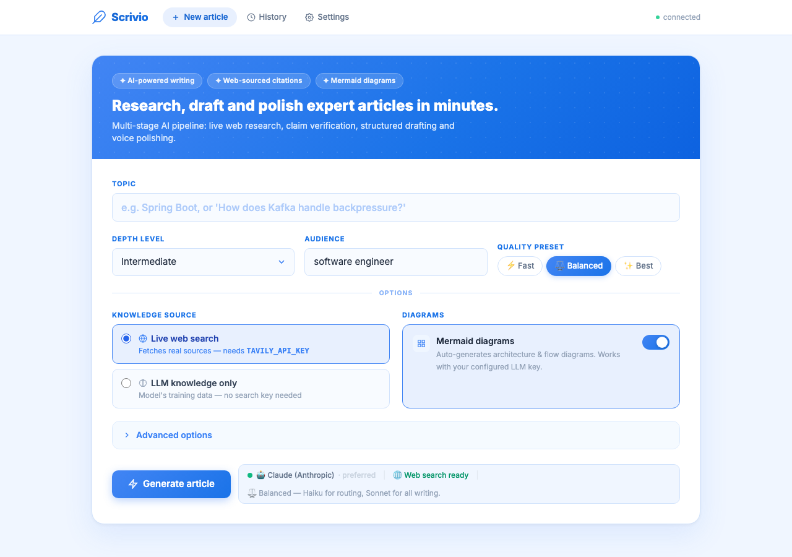

# Scrivio: AI Article Generator

> Research, draft and polish expert technical articles in minutes.

Scrivio is a multi-stage AI pipeline that turns a topic or question into a sourced, structured, and voice-polished technical article. It runs live web research, verifies every claim against fetched evidence, generates architecture diagrams, and applies a multi-pass editorial review, all before writing a single word of prose.

---

## Screenshot



---

## What It Does

You type a topic. Scrivio handles the rest:

- **Researches** the web for real, recent sources (not training data)
- **Plans** a section-by-section article structure aligned to your audience and depth level
- **Drafts** every section with inline citations tied to fetched evidence
- **Generates Mermaid diagrams** for architecture, flows, and sequence interactions
- **Verifies** each factual claim against the source it was drawn from
- **Edits** the draft for thesis alignment, voice, and structural issues (tables, transitions)
- **Polishes** the voice so it reads like a helpful colleague, not a generated document
- **Compiles** the final article with numbered references and resolved citations

Three quality presets let you trade speed for output quality. The model names are the Anthropic defaults; in OpenAI mode each one maps to its nearest GPT equivalent (Sonnet to GPT-4o, Haiku to GPT-4o-mini), so the preset still controls the speed/quality trade-off either way. See [Model Providers](#model-providers) for how the provider is selected.

| Preset   | Routing model        | Writing model    | Best for                          |
| -------- | -------------------- | ---------------- | --------------------------------- |
| Fast     | Haiku / GPT-4o-mini  | Sonnet / GPT-4o  | Quick drafts, prototyping         |
| Balanced | Haiku / GPT-4o-mini  | Sonnet / GPT-4o  | Default, best cost/quality ratio  |
| Best     | Sonnet / GPT-4o      | Sonnet / GPT-4o  | Production-quality articles       |

---

## Requirements

### API Keys

Scrivio needs **one LLM provider key** to run. It auto-selects the provider from whichever key is present (see [Model Providers](#model-providers) below).

| Key                 | Purpose                                                                                          | Required                                 |
| ------------------- | ------------------------------------------------------------------------------------------------ | ---------------------------------------- |
| `ANTHROPIC_API_KEY` | Runs the full pipeline on Claude (brief, planning, drafting, editing, critique, polish, diagrams)  | One LLM key required (see note)          |
| `OPENAI_API_KEY`    | Runs the full pipeline on GPT-4o / GPT-4o-mini, and powers the claim-verification agent           | One LLM key required (see note)          |
| `TAVILY_API_KEY`    | Live web search                                                                                  | Optional, only for live web search mode  |

> **Note:** You need **at least one** of `ANTHROPIC_API_KEY` or `OPENAI_API_KEY`. With only one set, that provider runs everything. With both set, the writing pipeline defaults to Anthropic (override with `LLM_PROVIDER=openai`). The verification stage currently always uses OpenAI, so a pure Anthropic-only setup runs without a separate verifier pass.

### System Dependencies

| Tool             | Purpose                   | Install                                                              |
| ---------------- | ------------------------- | -------------------------------------------------------------------- |
| Python 3.11+     | Runtime                   | [python.org](https://www.python.org/downloads/)                      |
| Node.js + `npx`  | Mermaid diagram rendering | [nodejs.org](https://nodejs.org/)                                    |
| VHS _(optional)_ | Terminal GIF rendering    | [github.com/charmbracelet/vhs](https://github.com/charmbracelet/vhs) |

---

## Installation

```bash
# 1. Clone the repo
git clone https://github.com/your-username/scrivio.git
cd scrivio

# 2. Create and activate a virtual environment
python -m venv .venv
source .venv/bin/activate       # macOS / Linux
# .venv\Scripts\activate        # Windows

# 3. Install Python dependencies
pip install -r requirements.txt

# 4. Set up environment variables
cp .env.example .env
# Edit .env and fill in your API keys (see below)
```

### `.env` file

At least one of the two LLM keys is required. Set `ANTHROPIC_API_KEY` alone to run everything on Claude, set `OPENAI_API_KEY` alone to run everything on GPT-4o, or set both to use Claude by default (override with `LLM_PROVIDER=openai`). The search key is optional and only needed for live web search mode.

```env
# At least ONE of the two LLM keys below is required.
ANTHROPIC_API_KEY=your_anthropic_key_here
OPENAI_API_KEY=your_openai_key_here

# Optional, only needed for live web search mode.
TAVILY_API_KEY=your_tavily_key_here

# Optional, when both LLM keys are set, choose the writer: anthropic (default) or openai.
LLM_PROVIDER=anthropic
```

---

## How to Use

### Web UI (recommended)

Start the server and open the browser:

```bash
uvicorn api.server:app --host 0.0.0.0 --port 8899
```

Then open **http://localhost:8899** in your browser.

**UI controls:**

| Field            | Description                                                                              |
| ---------------- | ---------------------------------------------------------------------------------------- |
| Topic            | Free-text: a keyword, question, or concept (e.g. "How does Kafka handle backpressure?")  |
| Depth Level      | Basic / Intermediate / Advanced, controls assumed prior knowledge                        |
| Audience         | Who the article is for (e.g. "software engineer", "tech lead")                            |
| Quality Preset   | Fast / Balanced / Best, trades cost for output quality                                   |
| Knowledge Source | Live web search (needs Tavily key) or LLM-only (no search key needed)                     |
| Diagrams         | Toggle Mermaid diagram generation on or off                                              |
| Advanced options | Extra context, must-cover topics, source age limit                                       |

The progress panel streams each pipeline stage in real time. The finished article appears when the pipeline completes.

### Command Line

```bash
# Basic run, no web search, no diagrams (fastest)
python main.py --topic "pytest best practices" --level basic --no-web --no-diagrams

# Full run with web search and diagrams
python main.py --topic "How does Kafka handle backpressure?" --level intermediate

# Specify audience and extra context
python main.py \
  --topic "Spring Security 6 filter chain" \
  --level advanced \
  --audience "Java backend engineer" \
  --extra-context "focus on OAuth2 resource server configuration"

# Change output directory
python main.py --topic "Redis caching patterns" --out ./my-articles
```

Output is written to `./output/<timestamp>__<slug>/` and contains:

- `intermediate.md`: the finished article at the requested depth level
- `meta.json`: request parameters, verification reports, and pipeline debug info

---

## Claude Code Skill

A standalone version of the pipeline is available as a Claude Code skill: no server, no API keys, and no installation required beyond Claude Code itself.

**Download:** [generate-article.skill](generate-article.skill)

**Install:** Drag the `.skill` file into any Claude Code chat window, or go to Settings → Skills → Install from file.

**Use it:**
> "Write an article about how Kafka handles backpressure"
> "Generate a technical article on Redis caching patterns"

Claude Code runs the pipeline automatically (web research, planning, drafting, editorial review, and voice polish) and writes the finished article as a markdown file in your current directory. Because the skill runs entirely inside Claude Code on a single model, it skips the separate cross-model verification stage that the full server pipeline performs.

---

## Architecture

Scrivio is a FastAPI server (`api/server.py`) that accepts article requests, runs the pipeline in a background asyncio task, and streams progress events to the browser over SSE. The UI (`ui/index.html`) is a single-page app served as a static file.

```
Browser (ui/index.html)
    │
    │  POST /generate  (start job)
    │  GET  /jobs/{id}/stream  (SSE progress)
    │  GET  /jobs/{id}/result  (final article)
    ▼
FastAPI server (api/server.py)
    │
    ▼
Pipeline orchestrator (main.py -> generate_article())
    │
    ├── Search worker        (Tavily web search)
    ├── Extraction worker    (fetch + chunk web pages)
    ├── Brief worker         (Claude Sonnet)
    ├── Relevance worker     (Claude Haiku, alignment gate)
    ├── Planning worker      (Claude Sonnet)
    ├── Drafting worker      (Claude Sonnet, parallel section drafts)
    ├── Mermaid worker       (Claude Haiku -> npx @mermaid-js/mermaid-cli)
    ├── Verification worker  (GPT-4o-mini, claim-by-claim fact check)
    ├── Editor worker        (Claude Sonnet, review + targeted revision)
    ├── Critic worker        (Claude Sonnet, final quality gate)
    ├── Humanisation worker  (Claude Sonnet, voice polish)
    └── Compiler worker      (citation resolution + final assembly)
```

**Model assignments** are centrally managed in `pipeline/model_config.py`. Every worker calls `get_model(role, preset)` instead of hard-coding a model string, so the quality preset slider in the UI controls the entire pipeline. The model names above are the Anthropic defaults; provider selection is described in [Model Providers](#model-providers).

---

## Model Providers

Scrivio is provider-flexible. It picks its LLM provider automatically from the keys in your environment, with no code change required.

| Keys present              | Pipeline runs on                                          | Verifier         |
| ------------------------- | --------------------------------------------------------- | ---------------- |
| `ANTHROPIC_API_KEY` only  | Claude (Sonnet + Haiku)                                   | GPT-4o-mini (1)  |
| `OPENAI_API_KEY` only     | GPT-4o + GPT-4o-mini                                       | GPT-4o-mini      |
| Both                      | Anthropic by default; `LLM_PROVIDER=openai` to switch     | GPT-4o-mini      |
| Neither                   | Mock client (placeholder text)                            | n/a              |

(1) Verification requires `OPENAI_API_KEY`. In an Anthropic-only setup, the verification stage is skipped.

Under the hood, every worker calls `client.messages.create(...)` against the Anthropic interface. When OpenAI is selected, `pipeline/providers/openai_adapter.py` wraps the OpenAI client in a shim that presents the same interface and maps model names (`*sonnet*` to `gpt-4o`, `*haiku*` to `gpt-4o-mini`), so no worker needs provider-specific branches. Provider selection itself lives in `main.py` (`_resolve_provider()` and `_anthropic_client()`), and `main.generate_article()`, used by both the CLI and the FastAPI server, threads the selected client through every writing stage.

> **Note:** the alternate Temporal orchestrator in `pipeline/orchestrator/article_workflow.py` still constructs `anthropic.AsyncAnthropic()` directly and does not yet honor provider auto-selection. It is not used by the default CLI or server path; if you switch to it, OpenAI-only mode will not apply until those calls are routed through `_anthropic_client()`.

---

## Pipeline: Stage by Stage

The Model column lists the Anthropic defaults. In OpenAI mode, Sonnet maps to GPT-4o and Haiku to GPT-4o-mini; the verification stage always uses GPT-4o-mini.

| #   | Stage                    | Model       | What it does                                                                                                                                                                                                                                                                 |
| --- | ------------------------ | ----------- | ---------------------------------------------------------------------------------------------------------------------------------------------------------------------------------------------------------------------------------------------------------------------------- |
| 1   | **Clarification**        | Sonnet      | Asks 2-3 follow-up questions when the topic is ambiguous or very broad. Skipped for narrow, specific topics.                                                                                                                                                                 |
| 2   | **Topic classification** | Haiku       | Classifies the topic as broad or narrow to decide whether clarification is worth asking.                                                                                                                                                                                     |
| 3   | **Brief**                | Sonnet      | Writes a story brief: thesis, angle (explainer / tutorial / deep-dive / comparison / war-story), reader pain point, hook seed, and suggested title.                                                                                                                          |
| 4   | **Relevance check**      | Haiku       | Validates that the brief's thesis and angle match the user's request. Catches brief drift (e.g. a war-story angle on a "What is X" question) before the expensive stages run.                                                                                                |
| 5   | **Search**               | Tavily      | Runs multiple targeted search queries derived from the topic and must-cover list. If fewer than 15 evidence chunks or 3 useful sources are returned, a fallback search runs automatically.                                                                                   |
| 6   | **Extraction**           | n/a         | Fetches each search result URL, strips boilerplate, splits content into overlapping chunks, and scores chunks for relevance.                                                                                                                                                 |
| 7   | **Planning**             | Sonnet      | Produces a section-by-section article plan. Each section gets a title, goal, key claims to make, and a pointer to which evidence spans to draw from.                                                                                                                         |
| 8   | **Gap-fill search**      | Tavily      | Detects sections with thin evidence coverage and runs additional targeted searches for those sections specifically.                                                                                                                                                          |
| 9   | **Drafting**             | Sonnet      | Drafts every section in parallel, injecting the relevant evidence spans and citing each claim with a UUID marker. Each section receives a summary of previous sections to maintain flow.                                                                                     |
| 10  | **Diagram spec**         | Haiku       | Generates Mermaid diagram specifications for sections that requested a visual (architecture diagrams, sequence diagrams, flow charts).                                                                                                                                       |
| 11  | **Diagram rendering**    | npx         | Renders each Mermaid spec to SVG via `@mermaid-js/mermaid-cli` and runs QA checks on the output.                                                                                                                                                                             |
| 12  | **Verification**         | GPT-4o-mini | Checks every inline claim against its cited evidence span. Drops or downgrades claims that are unsupported or irrelevant.                                                                                                                                                    |
| 13  | **Editor review**        | Sonnet      | Reviews the assembled draft for: request alignment, thesis drift, hook quality, voice patterns (em dashes, filler phrases), vague claims, cold transitions, scenario repetition, and structural improvement opportunities (comparison tables).                               |
| 14  | **Editor revision**      | Sonnet      | Re-drafts only the sections flagged by the editor, merging revision instructions with any structural hints (e.g. "add a comparison table with columns X, Y, Z").                                                                                                             |
| 15  | **Critic**               | Sonnet      | Final quality gate. Checks title patterns, opening framing, citation completeness, diagram accuracy, internal consistency, voice, structure, and code block fidelity. Issues are `blocking`, `moderate`, or `minor`. The article only proceeds if no blocking issues remain. |
| 16  | **Humanizer / Polish**   | Sonnet      | Rewrites passages flagged by the critic, removes AI-voice patterns, and runs a final em-dash scrub across the article.                                                                                                                                                       |
| 17  | **Citation resolution**  | n/a         | Replaces `[src:UUID]` inline markers with numbered references (`[1]`, `[2]`, ...) and builds the Sources section at the end of the article.                                                                                                                                  |
| 18  | **Compiler**             | n/a         | Assembles the final `PublishedArticle` object across all explanation levels (basic / intermediate / advanced). Writes the output markdown and `meta.json` to disk.                                                                                                           |

### How the editor and structural hints work

The editor runs two passes:

1. **Review pass:** reads the full assembled draft and emits:

   - Up to 3 **revision instructions** for sections that need re-drafting (e.g. "rewrite the opening to lead with the failure scenario, not the definition")
   - Any number of **structural hints** for sections that would benefit from a comparison table or labelled list. A hint fires when 3+ items are compared across 2+ axes, or when exactly 2 items are compared across 3+ axes.

2. **Revision pass:** re-drafts only the flagged sections. Structural hints are merged into the revision note so the drafter embeds the table naturally in the rewritten prose.

---

## Project Structure

```
scrivio/
├── api/
│   ├── server.py          # FastAPI app: endpoints, SSE streaming, job management
│   └── jobs.py            # In-memory job store
├── pipeline/
│   ├── model_config.py    # Central model-selection (Fast / Balanced / Best presets)
│   ├── cache.py           # Stage-level disk cache (avoids re-running expensive stages)
│   ├── providers/
│   │   └── openai_adapter.py  # OpenAI-to-Anthropic shim for provider flexibility
│   ├── schemas/
│   │   └── models.py      # Pydantic models for every pipeline object
│   ├── prompts/           # System prompts for each agent (plain text, version-tagged)
│   │   ├── brief_v1.txt
│   │   ├── relevance_checker_v1.txt
│   │   ├── planner_v1.txt
│   │   ├── drafter_v1.txt
│   │   ├── editor_v1.txt
│   │   ├── critic_v1.txt
│   │   ├── humanizer_v1.txt
│   │   └── verifier_v1.txt
│   └── workers/           # One file per pipeline stage
│       ├── brief_worker.py
│       ├── relevance_worker.py
│       ├── search_worker.py
│       ├── extraction_worker.py
│       ├── planning_worker.py
│       ├── drafting_worker.py
│       ├── editor_worker.py
│       ├── critic_worker.py
│       ├── humanization_worker.py
│       ├── verification_worker.py
│       ├── citation_utils.py
│       └── compiler_worker.py
├── render/
│   ├── mermaid_worker.py  # Mermaid spec generation + SVG rendering via npx
│   └── vhs_worker.py      # Terminal GIF rendering via VHS
├── ui/
│   └── index.html         # Single-page app (Tailwind CSS, vanilla JS, SSE client)
├── tests/                 # pytest test suite (192 tests)
├── main.py                # Pipeline orchestrator + CLI entry point
├── requirements.txt
└── .env.example
```

---

## Example Articles

The [`examples/`](examples/) folder contains five real articles generated by Scrivio:

| File                                                                              | Topic                                                      |
| --------------------------------------------------------------------------------- | ---------------------------------------------------------- |
| [spring-jpa-hibernate-explained.md](examples/spring-jpa-hibernate-explained.md)   | How Spring Data JPA, JPA, and Hibernate work together      |
| [spring-security-filter-chain.md](examples/spring-security-filter-chain.md)       | Spring Security filter chain and configuration             |
| [spring-ai-complete-overview.md](examples/spring-ai-complete-overview.md)         | Complete overview of Spring AI for Java backend developers |
| [kafka-design-patterns.md](examples/kafka-design-patterns.md)                     | Kafka design patterns for backend engineers                |
| [spring-boot-production-patterns.md](examples/spring-boot-production-patterns.md) | Production-level Spring Boot patterns                      |

> The `output/` directory (your local working folder) is git-ignored. Only the curated `examples/` folder is tracked.

---

## Running Tests

```bash
pytest tests/ -v
```

All 192 tests run without API keys; workers are tested with mocked responses.

---

## Output Format

Each generated article is saved to `output/<timestamp>__<slug>__<job-id>/`:

```
output/
└── 20260522-152810__what-is-spring-jpa__643de9b0/
    ├── intermediate.md   # Final article (Markdown with numbered citations)
    └── meta.json         # Request params, verification reports, asset metadata
```

The markdown file is self-contained and ready to paste into any blog platform, Notion, or documentation site that renders Markdown and Mermaid.

---

## License

MIT
