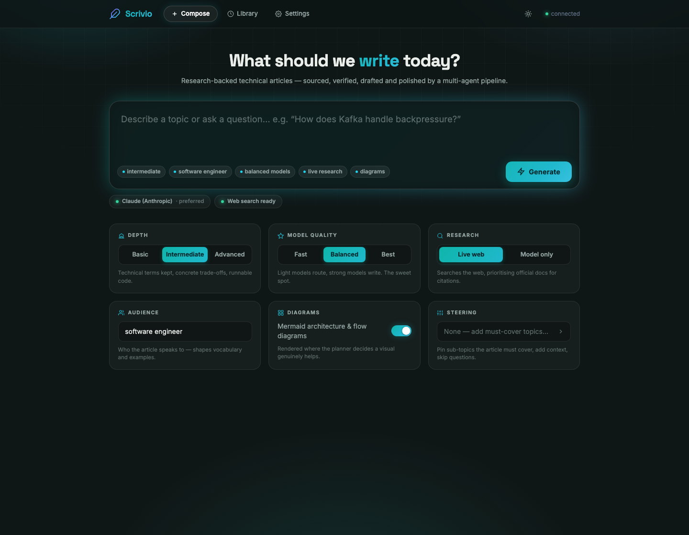
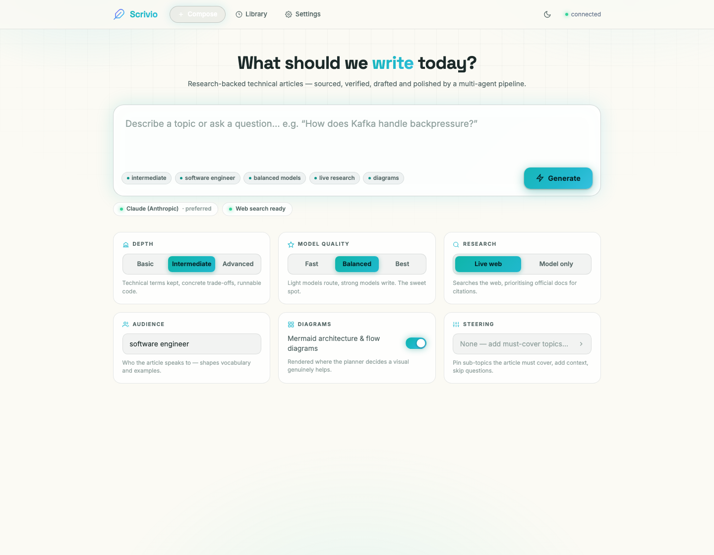

# Scrivio: AI Article Generator

> Research, draft and polish expert technical articles in minutes.

Scrivio is a multi-stage AI pipeline that turns a topic or question into a sourced, structured, and voice-polished technical article. It runs live web research, verifies every claim against fetched evidence, generates architecture diagrams, and applies a multi-pass editorial review, all before writing a single word of prose.

---

## Screenshots

Dark mode:



Light mode:



---

## What It Does

You type a topic. Scrivio handles the rest:

- **Resolves the source of truth** — identifies the official documentation domains for your topic (Kafka → kafka.apache.org, Java → docs.oracle.com) and prioritises them over blogs and Q&A forums
- **Researches** the web for real, recent sources (not training data), with a dedicated docs-first search pass
- **Plans** a section-by-section article structure aligned to your audience and depth level
- **Drafts** every section with inline citations tied to fetched evidence
- **Generates Mermaid diagrams** for architecture, flows, and sequence interactions
- **Verifies** each factual claim against the source it was drawn from — before drafting
- **Edits** the draft for thesis alignment, voice, and structural issues (tables, transitions)
- **Polishes** the voice so it reads like a helpful colleague, not a generated document
- **Resolves citations** into numbered references with a Sources section

Three quality presets let you trade speed for output quality. Presets are provider-agnostic — "light" and "strong" are tiers that map to Haiku/Sonnet on Anthropic, or to the equivalent GPT models on OpenAI (see [Model Providers](#model-providers)):

| Preset   | Routing stages | Writing stages | Best for                          |
| -------- | -------------- | -------------- | --------------------------------- |
| Fast     | Light model    | Strong model   | Quick drafts, prototyping         |
| Balanced | Light model    | Strong model   | Default — best cost/quality ratio |
| Best     | Strong model   | Strong model   | Production-quality articles       |

---

## Requirements

### API Keys

**One LLM key is enough.** Scrivio auto-selects its provider from whichever key is present; with only `OPENAI_API_KEY` set, every writing stage runs on GPT models through a built-in adapter (see [Model Providers](#model-providers)).

| Key                 | Purpose                                                                                                            | Required                          |
| ------------------- | ------------------------------------------------------------------------------------------------------------------ | --------------------------------- |
| `ANTHROPIC_API_KEY` | Claude models for the writing pipeline                                                                             | One of the two LLM keys           |
| `OPENAI_API_KEY`    | GPT models — full pipeline when it's the only key; always used for search-query generation and claim verification  | One of the two LLM keys           |
| `TAVILY_API_KEY`    | Live web search (Brave `BRAVE_SEARCH_API_KEY` or Exa `EXA_API_KEY` also work)                                      | Yes, if using live web search     |
| `JINA_API_KEY`      | Jina Reader — fallback fetcher for pages that block scrapers (Medium, Baeldung, …); Jina returns 401 without a key | Optional, improves source breadth |

### System Dependencies

| Tool             | Purpose                   | Install                                                              |
| ---------------- | ------------------------- | -------------------------------------------------------------------- |
| Python 3.11+     | Runtime                   | [python.org](https://www.python.org/downloads/)                      |
| Node.js + `npx`  | Mermaid diagram rendering | [nodejs.org](https://nodejs.org/)                                    |
| VHS _(optional)_ | Terminal GIF rendering    | [github.com/charmbracelet/vhs](https://github.com/charmbracelet/vhs) |

---

## Installation

```bash
# 1. Clone the repo
git clone https://github.com/your-username/scrivio.git
cd scrivio

# 2. Create and activate a virtual environment
python -m venv .venv
source .venv/bin/activate       # macOS / Linux
# .venv\Scripts\activate        # Windows

# 3. Install Python dependencies
pip install -r requirements.txt

# 4. Set up environment variables
cp .env.example .env
# Edit .env and fill in your API keys (see below)
```

### `.env` file

```env
# At least ONE of these two LLM keys is required:
ANTHROPIC_API_KEY=your_anthropic_key_here
OPENAI_API_KEY=your_openai_key_here

# Optional — live web search for real citations:
TAVILY_API_KEY=your_tavily_key_here

# Optional — fallback fetcher for scraper-blocking sites:
# JINA_API_KEY=your_jina_key_here

# Optional — only when both LLM keys are set, pick the default writer:
# LLM_PROVIDER=anthropic

# Optional — model overrides for OpenAI runs (defaults: gpt-5.4 / gpt-5.4-mini):
# OPENAI_STRONG_MODEL=gpt-5.4
# OPENAI_LIGHT_MODEL=gpt-5.4-mini
# OPENAI_REASONING_EFFORT=low   # none | minimal | low | medium | high
```

---

## How to Use

### Web UI (recommended)

Start the server and open the browser:

```bash
python -m uvicorn api.server:app --host 0.0.0.0 --port 8899
```

Then open **http://localhost:8899** in your browser.

The UI is a composer-style studio: a large prompt box up top, and the configuration underneath as a deck of control cards. Everything you set is echoed live as a chip trail inside the composer, so you always see exactly what you're about to run. `Cmd/Ctrl+Enter` submits from the prompt box.

**Configuration deck:**

| Card          | Description                                                                                                        |
| ------------- | ------------------------------------------------------------------------------------------------------------------ |
| Prompt box    | Free-text — a keyword, question, or concept (e.g. "How does Kafka handle backpressure?")                           |
| Depth         | Basic / Intermediate / Advanced segmented control — each choice shows a one-line hint of what it means             |
| Model quality | Fast / Balanced / Best — trades cost for output quality                                                            |
| Provider      | Auto / Claude / GPT — pin this article's writing provider; options without a configured key are disabled           |
| Research      | Live web (docs-first search, needs a search key) or Model only (no search key needed)                              |
| Audience      | Who the article is for (e.g. "software engineer", "tech lead")                                                     |
| Diagrams      | Toggle Mermaid diagram generation on or off                                                                        |
| Steering      | Drawer with extra context, must-cover topics, and a skip-clarification switch — its trigger summarises what's set  |

**Theme:** the sun/moon button in the header switches between dark (ink-teal studio) and light (paper-cream) modes. The choice persists across sessions; first-time visitors get their OS preference. `?theme=dark|light` in the URL forces a mode for shareable links.

**During generation** the execution view shows the full pipeline roadmap up front: every stage with its own symbol, a chip naming the model that executes it, a live progress bar, and per-stage timers. Each stage has an ⓘ info panel explaining what it does, plus an expandable debug panel with run data (search queries, fetched URLs with trust scores, verifier verdicts, critic issues). Stages served from the disk cache show a ⚡ cached chip. If a run fails, the error is pinned to the failing stage with a **Resume** button — completed stages replay from cache, so a retry picks up where it stopped instead of re-running everything.

**Library:** every generated article is browsable, and each has a **Re-run** button that routes back to the composer with all original settings prefilled for editing. Re-runs stack as version chains — one library card per article showing `↻ v2`, with a version dropdown in the article view to read any earlier run.

### Command Line

```bash
# Basic run, no web search, no diagrams (fastest)
python main.py --topic "pytest best practices" --level basic --no-web --no-diagrams

# Full run with web search and diagrams
python main.py --topic "How does Kafka handle backpressure?" --level intermediate

# Specify audience and extra context
python main.py \
  --topic "Spring Security 6 filter chain" \
  --level advanced \
  --audience "Java backend engineer" \
  --extra-context "focus on OAuth2 resource server configuration"

# Change output directory
python main.py --topic "Redis caching patterns" --out ./my-articles
```

Output is written to `./output/<timestamp>__<slug>__<job-id>/` and contains:

- `intermediate.md`: the finished article at the requested depth level
- `meta.json`: request parameters, verification reports, and pipeline debug info

---

## Claude Code Skill

A standalone version of the pipeline is available as a Claude Code skill: no server, no API keys, and no installation required beyond Claude Code itself.

**Download:** [generate-article.skill](generate-article.skill)

**Install:** Drag the `.skill` file into any Claude Code chat window, or go to Settings → Skills → Install from file.

**Use it:**

> "Write an article about how Kafka handles backpressure"
> "Generate a technical article on Redis caching patterns"

Claude Code runs the pipeline automatically (web research, planning, drafting, editorial review, and voice polish) and writes the finished article as a markdown file in your current directory. Because the skill runs entirely inside Claude Code on a single model, it skips the separate cross-model verification stage that the full server pipeline performs.

---

## Architecture

Scrivio is a FastAPI server (`api/server.py`) that accepts article requests, runs the pipeline in a background asyncio task, and streams progress events to the browser over SSE. The UI (`ui/index.html`) is a single-page app served as a static file.

```
Browser (ui/index.html)
    │
    │  POST /generate  (start job)
    │  GET  /jobs/{id}/stream  (SSE progress)
    │  GET  /articles  (library, grouped into re-run version chains)
    ▼
FastAPI server (api/server.py)
    │
    ▼
Pipeline orchestrator (main.py -> generate_article())
    │
    ├── Source resolver      (light model — topic → official-docs domains)
    ├── Search worker        (Tavily / Brave / Exa, docs-first pass + general pass)
    ├── Extraction worker    (fetch + chunk web pages, tiered trust scoring)
    ├── Brief worker         (strong model — thesis, angle, hook)
    ├── Relevance worker     (light model — brief↔request alignment gate)
    ├── Planning worker      (strong model — sections, claims, visual intents)
    ├── Verification worker  (OpenAI — claim-by-claim fact check, before drafting)
    ├── Drafting worker      (strong model — parallel section drafts)
    ├── Mermaid worker       (light model → npx @mermaid-js/mermaid-cli)
    ├── Editor worker        (strong model — review + targeted revision)
    ├── Polisher             (strong model — combined level-adapt + voice polish)
    ├── Critic worker        (strong model — final quality gate, 1 refine loop)
    └── Citation utils       (marker → numbered reference resolution)
```

**Model assignments** are centrally managed in `pipeline/model_config.py`. Every worker calls `get_model(role, preset)` instead of hard-coding a model string, so the quality preset in the UI controls the entire pipeline. At run start the server emits a `pipeline_info` event naming the exact model for each stage, which the UI displays as chips on the pipeline roadmap.

**Prompts** live in `pipeline/prompts/` as version-tagged text files, assembled by `pipeline/prompt_loader.py`. Shared fragments (`_voice_canon_v1.txt` for voice rules and banned phrases, `_preserve_markers_v1.txt` for citation/diagram marker preservation) are injected via `{{include:...}}` directives so every writing and reviewing agent works from one rulebook.

**Caching:** expensive stage outputs (brief, search, planning, verification, drafting, editor, polish) are disk-cached by input hash under `.cache/article_pipeline/`. Re-running an identical request fast-forwards through cached stages — this is what powers Resume-after-failure and cheap re-runs.

### Doc-first citations

Citations follow a strict precedence: **official docs > articles > Q&A forums**. Before searching, a small model resolves the topic's official documentation domains (with a static seed map as fallback; shared hosts like github.com or medium.com can never be blessed as "official"). Those domains get a dedicated domain-restricted search pass, score highest in trust ranking, and win the planner's evidence slots — capped at half the fetch budget so articles still cite diverse sources.

Trust tiers (`score_url`): official topic docs `1.0` → curated high-trust list `0.9` → docs-looking URLs on unknown domains `0.8` → GitHub `0.7` → blog platforms `0.65` → unknown HTTPS `0.6` → Stack Overflow / Reddit / Q&A forums `0.45` → plain HTTP `0.35`.

---

## Model Providers

Scrivio is provider-flexible. It picks its LLM provider automatically from the keys in your environment, and any single article can pin a provider from the composer's Provider card.

| Keys present             | Writing pipeline runs on                                | Verifier        |
| ------------------------ | ------------------------------------------------------- | --------------- |
| `ANTHROPIC_API_KEY` only | Claude (Sonnet + Haiku)                                 | mocked (1)      |
| `OPENAI_API_KEY` only    | GPT (defaults: gpt-5.4 + gpt-5.4-mini)                  | GPT-4o-mini     |
| Both                     | Anthropic by default; `LLM_PROVIDER=openai` to switch   | GPT-4o-mini     |
| Neither                  | Mock client (placeholder text)                          | mocked          |

(1) Claim verification and search-query generation always run on OpenAI. Without `OPENAI_API_KEY` they fall back to a mock, so claims pass through unverified — an Anthropic-only setup still generates articles, but without the cross-model fact-check.

**Selection order:** a per-request pin (`llm_provider` in the request, set from the UI's Provider card) wins when its key is present; otherwise the key-based auto rules above apply. A pin whose key is missing falls back to auto with a warning — a stale saved request can never break generation.

Under the hood, every worker calls `client.messages.create(...)` against the Anthropic interface. When OpenAI is selected, `pipeline/providers/openai_adapter.py` wraps the OpenAI client in a shim that presents the same interface: system prompts, forced tool-choice, and stop reasons are translated, model names map by tier (Sonnet/Opus → `OPENAI_STRONG_MODEL`, Haiku → `OPENAI_LIGHT_MODEL`), and reasoning models get token-budget headroom plus a tunable `OPENAI_REASONING_EFFORT`. No worker has provider-specific branches. Provider selection lives in `main.py` (`_resolve_provider()` / `_anthropic_client()`).

> **Note:** the alternate Temporal orchestrator in `pipeline/orchestrator/article_workflow.py` still constructs `anthropic.AsyncAnthropic()` directly and does not honor provider auto-selection. It is not used by the default CLI or server path; if you switch to it, OpenAI-only mode will not apply until those calls are routed through `_anthropic_client()`.

---

## Pipeline: Stage by Stage

| #   | Stage                    | Model          | What it does                                                                                                                                                                                                                                                                                        |
| --- | ------------------------ | -------------- | ---------------------------------------------------------------------------------------------------------------------------------------------------------------------------------------------------------------------------------------------------------------------------------------------------- |
| 1   | **Clarification**        | Sonnet         | Asks 2-3 follow-up questions when the topic is ambiguous or very broad. Skipped for narrow, specific topics.                                                                                                                                                                                        |
| 2   | **Topic classification** | Haiku          | Classifies the topic as broad or narrow to decide whether clarification is worth asking.                                                                                                                                                                                                            |
| 3   | **Brief**                | Sonnet         | Writes a story brief: thesis, angle (explainer / tutorial / deep-dive / comparison / war-story), reader pain point, hook seed, and suggested title.                                                                                                                                                 |
| 4   | **Relevance check**      | Haiku          | Validates that the brief's thesis and angle match the user's request. Catches brief drift (e.g. a war-story angle on a "What is X" question) before the expensive stages run.                                                                                                                       |
| 5   | **Official sources**     | Haiku          | Resolves the topic's official documentation domains (Kafka → kafka.apache.org, Java → docs.oracle.com) via a static seed map plus a small model call. These domains drive the docs-first search pass and outrank all other sources in trust scoring.                                                |
| 6   | **Search**               | — (search API) | Runs a docs-first pass restricted to the official domains plus general targeted queries. Results are ranked by trust tier before fetching; official docs win the budget (capped at half for diversity). If fewer than 15 evidence chunks or 4 useful sources survive, a fallback search runs.       |
| 7   | **Extraction**           | —              | Fetches each search result URL, strips boilerplate, splits content into overlapping chunks, and scores chunks for relevance. Implausibly small extractions trigger whole-document re-extraction.                                                                                                    |
| 8   | **Planning**             | Sonnet         | Produces a section-by-section article plan. Each section gets a title, goal, key claims to make, and a pointer to which evidence spans to draw from.                                                                                                                                                |
| 9   | **Gap-fill search**      | — (search API) | Detects sections with thin evidence coverage and runs additional targeted searches for those sections specifically.                                                                                                                                                                                 |
| 10  | **Verification**         | GPT (OpenAI)   | Runs BEFORE drafting (a journalist fact-checks before writing). Checks every planned claim against its cited evidence span. Drops or downgrades claims that are unsupported or irrelevant.                                                                                                          |
| 11  | **Drafting**             | Sonnet         | Drafts every section in parallel, injecting the relevant evidence spans and citing each claim with a UUID marker. Each section receives a summary of previous sections to maintain flow.                                                                                                            |
| 12  | **Diagram spec**         | Haiku          | Generates Mermaid diagram specifications for sections that requested a visual (architecture diagrams, sequence diagrams, flow charts).                                                                                                                                                              |
| 13  | **Diagram rendering**    | — (npx)        | Renders each Mermaid spec to SVG via `@mermaid-js/mermaid-cli` and runs QA checks on the output.                                                                                                                                                                                                    |
| 14  | **Editor review**        | Sonnet         | Reviews the assembled draft for: request alignment, thesis drift, hook quality, voice patterns (em dashes, filler phrases), vague claims, cold transitions, repetition (including within a section), and structural improvement opportunities (comparison tables).                                  |
| 15  | **Editor revision**      | Sonnet         | Re-drafts only the sections flagged by the editor, merging revision instructions with any structural hints (e.g. "add a comparison table with columns X, Y, Z").                                                                                                                                    |
| 16  | **Polisher**             | Sonnet         | One combined pass replacing the old compile+humanize sequence: adapts the draft to the requested depth level AND rewrites for natural voice. If the critic flags blocking issues, it runs once more with the critic's issue list as targeted fixes.                                                 |
| 17  | **Critic**               | Sonnet         | Final quality gate on the polished article. Checks title patterns, opening framing, citation completeness, diagram accuracy, internal consistency (duplicated statements, worked-example drift), voice, structure, and code fidelity. Issues are `blocking`, `moderate`, or `minor`.                |
| 18  | **Citation resolution**  | —              | Replaces `[src:UUID]` inline markers with numbered references (`[1]`, `[2]`, …) and builds the Sources section at the end of the article.                                                                                                                                                           |
| 19  | **Assembly**             | —              | Builds the final `PublishedArticle` at the requested explanation level, embeds rendered diagrams, and writes the output markdown and `meta.json` to disk.                                                                                                                                           |

> The Model column shows the balanced-preset Anthropic assignment. Presets map roles to light/strong tiers; with an OpenAI writer the adapter maps those tiers to the equivalent GPT models. Search-query generation and verification always run on OpenAI when its key is present.

### How the editor and structural hints work

The editor runs two passes:

1. **Review pass:** reads the full assembled draft and emits:

   - Up to 3 **revision instructions** for sections that need re-drafting (e.g. "rewrite the opening to lead with the failure scenario, not the definition")
   - Any number of **structural hints** for sections that would benefit from a comparison table or labelled list. A hint fires when 3+ items are compared across 2+ axes, or when exactly 2 items are compared across 3+ axes.

2. **Revision pass:** re-drafts only the flagged sections. Structural hints are merged into the revision note so the drafter embeds the table naturally in the rewritten prose.

---

## Project Structure

```
scrivio/
├── api/
│   ├── server.py              # FastAPI app: endpoints, SSE streaming, job management
│   └── jobs.py                # In-memory job store
├── pipeline/
│   ├── model_config.py        # Central model-selection (Fast / Balanced / Best presets)
│   ├── cache.py               # Stage-level disk cache (resume + cheap re-runs)
│   ├── prompt_loader.py       # Prompt assembly — expands {{include:...}} shared fragments
│   ├── providers/
│   │   └── openai_adapter.py  # OpenAI→Anthropic shim: full pipeline on an OpenAI-only key
│   ├── schemas/
│   │   └── models.py          # Pydantic models for every pipeline object
│   ├── prompts/               # System prompts for each agent (plain text, version-tagged)
│   │   ├── _voice_canon_v1.txt        # shared fragment: voice rules + banned lists
│   │   ├── _preserve_markers_v1.txt   # shared fragment: citation/diagram marker rules
│   │   ├── brief_v2.txt
│   │   ├── relevance_checker_v2.txt
│   │   ├── planner_v2.txt
│   │   ├── drafter_v2.txt
│   │   ├── editor_v2.txt
│   │   ├── critic_v2.txt
│   │   ├── polisher_v2.txt            # combined level-adapter + copyeditor pass
│   │   ├── compiler_v2.txt
│   │   ├── diagram_spec_v2.txt
│   │   ├── vhs_tape_v2.txt
│   │   ├── verifier_v2.txt
│   │   ├── clarification_v1.txt
│   │   └── clarification_questions_v1.txt
│   └── workers/               # One file per pipeline stage
│       ├── source_resolver.py # topic → official-docs domains (doc-first citations)
│       ├── topic_classifier.py
│       ├── brief_worker.py
│       ├── relevance_worker.py
│       ├── search_worker.py
│       ├── extraction_worker.py
│       ├── planning_worker.py
│       ├── drafting_worker.py
│       ├── editor_worker.py
│       ├── critic_worker.py
│       ├── humanization_worker.py
│       ├── verification_worker.py
│       ├── citation_utils.py
│       └── compiler_worker.py
├── render/
│   ├── mermaid_worker.py      # Mermaid spec generation + SVG rendering via npx
│   └── vhs_worker.py          # Terminal GIF rendering via VHS
├── ui/
│   └── index.html             # Single-page app (Tailwind CSS, vanilla JS, SSE client)
├── tests/                     # pytest test suite (219 tests)
├── main.py                    # Pipeline orchestrator + CLI entry point
├── requirements.txt
└── .env.example
```

---

## Example Articles

The [`examples/`](examples/) folder contains five real articles generated by Scrivio:

| File                                                                              | Topic                                                      |
| --------------------------------------------------------------------------------- | ---------------------------------------------------------- |
| [spring-jpa-hibernate-explained.md](examples/spring-jpa-hibernate-explained.md)   | How Spring Data JPA, JPA, and Hibernate work together      |
| [spring-security-filter-chain.md](examples/spring-security-filter-chain.md)       | Spring Security filter chain and configuration             |
| [spring-ai-complete-overview.md](examples/spring-ai-complete-overview.md)         | Complete overview of Spring AI for Java backend developers |
| [kafka-design-patterns.md](examples/kafka-design-patterns.md)                     | Kafka design patterns for backend engineers                |
| [spring-boot-production-patterns.md](examples/spring-boot-production-patterns.md) | Production-level Spring Boot patterns                      |

> The `output/` directory (your local working folder) is git-ignored. Only the curated `examples/` folder is tracked.

---

## Running Tests

```bash
pytest tests/ -v
```

All 219 tests run without API keys — the suite forces mock LLM clients for every test, so it can never spend API credits.

---

## Output Format

Each generated article is saved to `output/<timestamp>__<slug>__<job-id>/`:

```
output/
└── 20260522-152810__what-is-spring-jpa__643de9b0/
    ├── intermediate.md   # Final article (Markdown with numbered citations)
    └── meta.json         # Request params, verification reports, asset metadata
```

The markdown file is self-contained and ready to paste into any blog platform, Notion, or documentation site that renders Markdown and Mermaid. Re-runs record their lineage in `meta.json` (`request.rerun_of`), which the library uses to group versions.

---

## License

MIT
