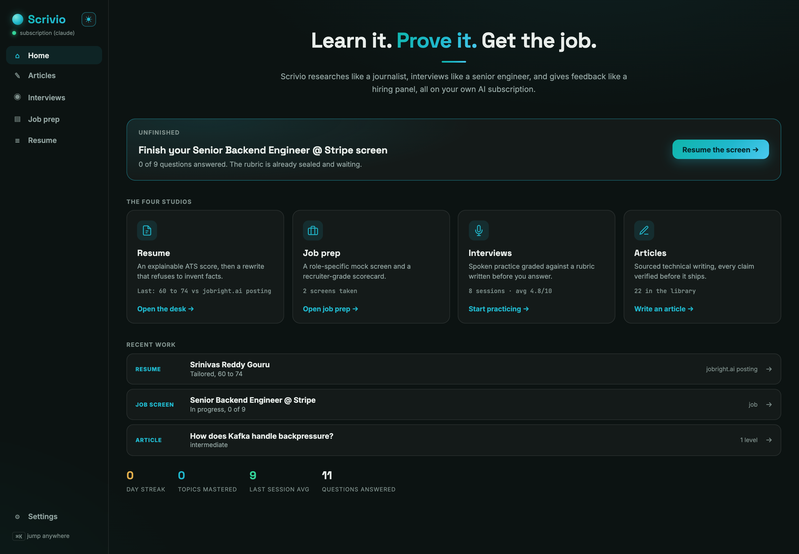
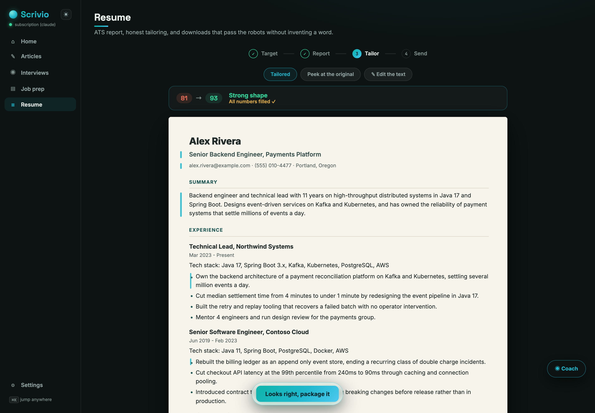
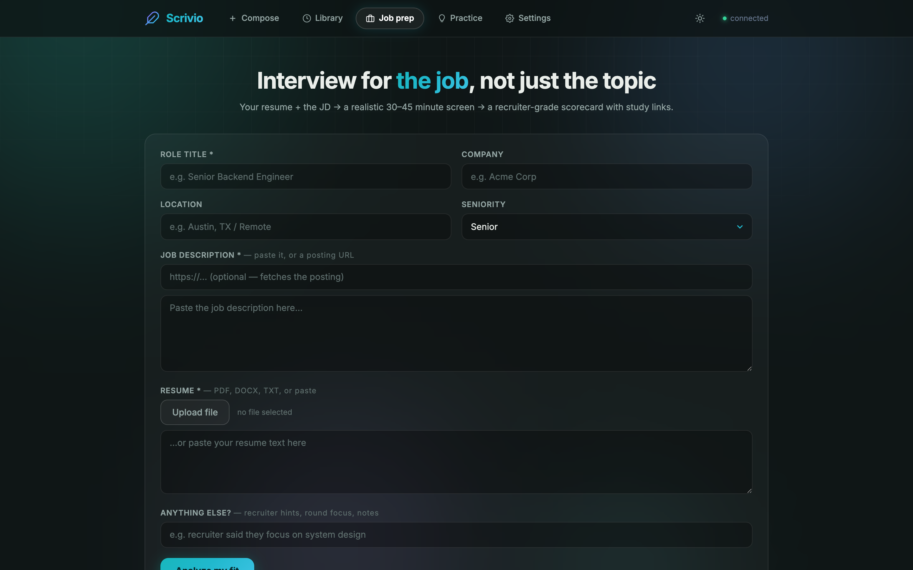
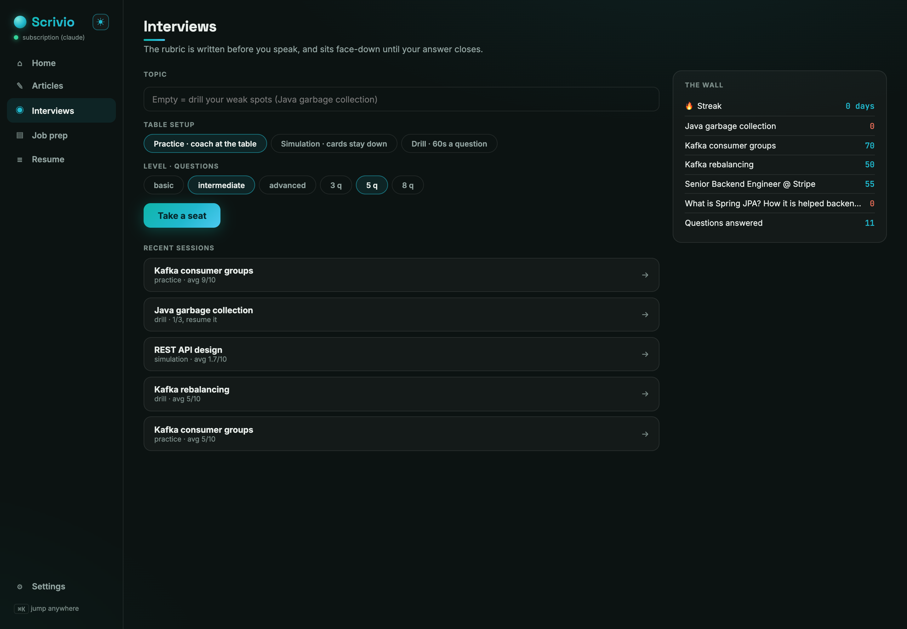
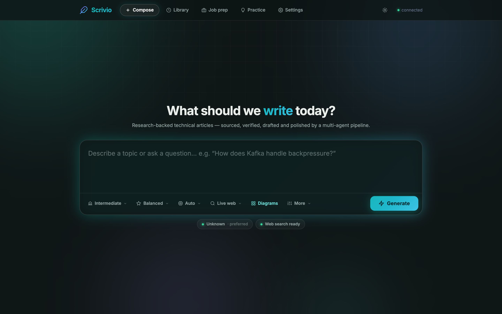

# Scrivio

> **Learn it. Prove it. Get the job.**
> Honest ATS-aware resume tailoring, job-targeted mock interviews with recruiter-grade scorecards, voice-first interview practice graded against a rubric sealed before you speak, and deep-researched technical articles, all running on the AI subscription you already pay for.

Scrivio started as an article generator and grew into a job-search platform. It edits your resume like a writer with ethics (explainable ATS checks, tailoring that refuses to invent a single fact), gives feedback like a hiring panel (competency scorecards, hire signals, cited study plans), interviews like a senior engineer (spoken questions, a rubric written before you answer, real follow-ups), and researches like a journalist (live web sources, every claim fact-checked).

Two things here are unusual enough to be the reason to look: **the honesty guards**, which are deterministic Python that reverts any number or employer a model invents rather than prompt text asking it not to, and **the eval harness**, which is why the roadmap below is written from measurements instead of opinion, including where it says this project loses.



---

## The four studios

Ordered by how well the evidence supports them. The resume and interview
work is where this project's differentiated engineering lives; the article
studio is measured, honestly, as the weakest of the four (see
[the matchup evals](#measured-not-asserted-the-article-matchup-evals)).

### 📄 Resume studio



Upload or paste your resume; get a report you can argue with, then a rewrite you can trust:

- **An explainable ATS score, not a magic number.** A weighted checklist computed in plain Python (contact info placement, standard headers, quantified bullets, date consistency, single-column parse safety, stuffing detection…), each row showing exactly why it passed or failed. With a JD attached (paste, URL, or a saved job target from Job prep), a deterministic **keyword-match** percentage joins the score: 70% checks + 30% coverage
- **Structured, not a text blob.** The resume is extracted once into the [JSON Resume](https://jsonresume.org) open standard (the architecture lesson borrowed from [Reactive Resume](https://github.com/AmruthPillai/Reactive-Resume)); every check, edit, and export operates on that structure. Import an existing `resume.json`, export to **PDF (what application portals want), Word (.docx), Markdown, or JSON Resume**, and the JSON round-trips into Reactive Resume and the rest of that ecosystem
- **Honest tailoring is the whole point.** The rewrite reorders, rephrases, and surfaces your *existing* experience in the JD's vocabulary. It will not invent employers, titles, dates, degrees, or skills: missing metrics become `[METRIC]` placeholders for you to fill, unclaimable keywords are listed as *"cannot honestly claim"*, and deterministic post-guards strip any invention a model sneaks through. Employers, titles, and dates must pass byte-identical, and **any number that came from neither your resume nor you is reverted**, with a note naming the figure it refused
- **The paper is the interface.** Findings are drawn *on* the resume, not in a report beside it. Teal marks are edits (hover for what changed and why); amber marks are honesty notes anchored to the exact line they question. Click one and answer it in your own words, and the line turns teal. Every pass reports its own score delta, so a fix that does not move the score says so
- **Nothing ships half-finished.** The packaging button stays disabled while `[METRIC]` placeholders or unsaved edits remain, and every change is one Undo away

---

### 💼 Job interview prep



Upload your resume and a job description; interview for *that* job:

- **Fit analysis.** Five to eight competencies derived from the JD itself, each mapped against your resume's evidence (strong / partial / missing), with the gaps a sharp interviewer would probe
- **A realistic 30 to 45 minute screen.** Warm-up → resume deep-dive (it grills *your own claims* by name) → technical → behavioral (STAR required) → gap-probe → closing, using questions real interviewers ask for that role and company
- **Recruiter-grade scorecard.** A hire signal calibrated to the role's seniority, per-competency scores with quoted evidence from your answers, JD requirement coverage (met/partial/missing), panel notes, and a **study plan with trust-ranked citations** for every weak area

### 🎤 Topic practice



Voice interviews on any topic, with grading you can trust:

- **The interviewer speaks** (natural TTS), **you answer out loud** (live dictation transcript, editable before submit)
- **Hidden rubric.** The grading rubric and ideal answer are written *before* you answer and physically withheld from the client until the question closes; the grader scores against a fixed bar it cannot sweet-talk
- **Three modes.** Practice (feedback each answer + one drill-down follow-up), Simulation (silent grading, end-of-screen debrief with hire signal), Drill (60-second rapid fire seeded from your weak spots)
- **Progress that compounds.** Topic mastery (recent sessions weighted), daily streaks, badges, confidence calibration (predict your score before the verdict), and weak areas that automatically seed your next drill
- **Coding rounds grade the interview, not the submission.** One problem worked through four phases, each with a rubric sealed before you start: clarify what you need to know before writing anything, state the approach and what it costs, implement, then defend it when the interviewer pushes. The problem withholds some constraints on purpose, and finding them is what the clarify phase scores, because candidates fail these rounds for not asking far more often than for not knowing. Your code is checked by parsing it, never by running it: whether it parses, defines the signature you were given, returns anything, and how deep its loops nest are handed to the grader as facts, so a confident explanation cannot cover a syntax error

### ✏️ Article studio


Type a topic, get a sourced technical article. **Read the eval section
below before judging this one:** a single prompt to the same model beats
this pipeline on prose, and rebuilding it around one research-grounded
generation is the top item on the roadmap. What it does keep, and what the
baseline has no answer to, is the citation trail:

- **Docs-first research.** Scrivio resolves the official documentation domains for your topic (Kafka → kafka.apache.org) and ranks them above blogs and Q&A forums by trust tier
- **Verify before draft.** Every claim is checked against fetched evidence *before* a word of prose is written; unsupported claims are dropped, not published
- **Editorial pipeline.** Plan → draft with inline citations → editor review → targeted revision → level compilation (basic/intermediate/advanced) → voice polish → final critic gate
- **Citation integrity.** Versioned documentation is collapsed to one entry per page at its newest release, so a single doc cannot appear three times as three references, and a lone hit on an old release is re-fetched at the current one. User-hosted pages do not qualify as documentation, which keeps a personal blog from outranking the official reference
- **Mermaid diagrams**, numbered citations with a Sources section, resumable runs served from a stage cache

## Screenshots

The images above are captured from a running instance, so they stay honest
about what the app currently looks like:

```bash
python -m uvicorn api.server:app --port 8899   # in another shell
python scripts/capture_screenshots.py          # --light for light theme too
```

---

## Bring your own subscription (zero API cost)

Scrivio's LLM calls can route through **any local AI CLI** instead of a metered API. Which CLI is pure configuration (`LLM_CLI` in Settings), not code: each is described by a spec (invocation, output parsing, model tiers, auth quirks):

| `LLM_CLI` | Runs on | Notes |
| --------- | ------- | ----- |
| `claude` *(default)* | Claude Pro/Max via Claude Code | Reference implementation; also powers **subscription web search** |
| `codex` | ChatGPT Plus/Pro via Codex CLI | `codex exec`, read-only sandbox |
| `gemini` | Google account via Gemini CLI | JSON output mode |
| `qwen` | Qwen Code free tier | Gemini CLI fork |
| `ollama` | **Local models, no account at all** | `ollama run`, fully offline LLM |

The adapter strips API-key env vars from CLI subprocesses so your subscription login is actually used (an inherited `ANTHROPIC_API_KEY`/`OPENAI_API_KEY` would silently win and bill the API). Structured output works on every CLI via JSON-forcing with a self-correcting retry. Trade-off, stated honestly: CLI calls are slower than the API (a process spawn per call) and bound by your plan's own limits. That is a good fit for interviews and a workable but slow one for batch article generation.

**Zero-key quickstart** (Claude subscription):

```bash
npm install -g @anthropic-ai/claude-code && claude login
```

Then select **"Local CLI"** as the provider in Scrivio's Settings. Articles (including live web search and fact-checking) and all interview modes now run at no marginal cost.

---

## Installation

```bash
git clone https://github.com/srinivas-reddy-gouru/scrivio.git
cd scrivio
python -m venv .venv && source .venv/bin/activate
pip install -r requirements.txt
cp .env.example .env   # optional: only needed for API keys and search keys
```

Run the server and open **http://localhost:8899**:

```bash
python -m uvicorn api.server:app --host 0.0.0.0 --port 8899
```

### Keys (all optional if a local CLI is signed in)

| Key | Purpose |
| --- | ------- |
| `ANTHROPIC_API_KEY` / `OPENAI_API_KEY` | API-billed LLM providers (faster than CLI) |
| `TAVILY_API_KEY` (or Brave/Exa) | Live web search; without any, search falls back to the Claude CLI's WebSearch tool, then degrades gracefully |
| `OPENAI_API_KEY` (again) | Voice extras: natural interviewer TTS + Whisper transcription. Without it, the browser's built-in voice and dictation take over (Chrome dictation is free and live) |
| `JINA_API_KEY` | Fallback fetcher for scraper-blocking sites |

### Model selection is your call, not ours

Presets (Fast / Balanced / Best) decide which **tier** each pipeline stage uses. What model each tier *is* belongs to you, in Settings, scoped to your active provider:

- **Large tasks** (writing, editing, interview grading) and **Small tasks** (routing, checks, diagrams) each get a model dropdown with the current lineup plus an *Other…* free-text escape hatch
- Per-CLI knobs: `CLI_STRONG_MODEL` / `CLI_LIGHT_MODEL`, and `CLI_FORCE_MODEL` to pin every call to one model (the quota-saver switch)

---

## How the interview grading stays honest

The pattern that runs through everything: **the bar is set before you speak.**

1. Question generation writes the rubric (three to five checkable points) and an ideal answer *first*
2. The server redacts both from every API response until the question closes, so you cannot peek and the grader cannot drift
3. Scoring is mechanically banded (9 to 10 means every rubric point; 0 to 2 means wrong or empty); length, confidence, and buzzwords earn nothing; a "strength" must quote your actual words
4. Summaries and scorecards are computed deterministically from stored evaluations, with no closing LLM call that could inflate the numbers (the narrative debrief is additive garnish, never the source of scores)

---

## CLI usage (articles)

```bash
python main.py --topic "How does Kafka handle backpressure?" --level intermediate
python main.py --topic "pytest best practices" --level basic --no-web --no-diagrams
```

Output lands in `./output/<timestamp>__<slug>__<id>/` with the article markdown and a `meta.json` of verification reports. Interview sessions persist under `output/interviews/`, job targets under `output/job_profiles/`, resume reports under `output/resumes/`.

## Claude Code skill

A standalone version of the article pipeline ships as a Claude Code skill that needs no server and no keys: [generate-article.skill](generate-article.skill). Drag it into a Claude Code chat, then `/generate-article "your topic"`.

---

## Development

```bash
python3 -m pytest -q            # the full suite: hermetic, no network, no keys
```

The suite is deliberately isolated from the host machine: mock LLM clients for every pipeline stage, and fixtures that neutralize the developer's own `.env` preferences, installed CLIs, and saved model overrides (all three have caused order-dependent failures before; see `tests/conftest.py`).

## Measured, not asserted: the article matchup evals

`python -m evals.matchup` runs the question that matters, **is the pipeline actually better than one prompt to the same model?**, as a blind experiment: same topics, both arms on your own subscription, position-swapped pairwise judging (a win must hold in both orders) by two independent judges (Claude strong tier + GPT-4o), with measured wall-clock and true LLM-call counts.

The verdict so far (Aug 2026, 3 topics + 2 post-fix rematches): **the one-prompt baseline leads 6 overall verdicts to 0, with 4 ties**, at roughly one eighth the wall time and 1/35th the calls. Chasing the judges' reasons produced real fixes (a fence-blind whitespace cleanup in citation resolution was silently de-indenting every code block in every article; a formulaic zinger-per-section cadence; SEO-blog citations for facts official docs in evidence stated), and the rematches show the fixed axes moving from losses to ties. What remains is structural: independently generated stages drift into self-contradiction in ways a single coherent generation doesn't. The honest conclusion this harness forced: the pipeline's one measured edge is its citation trail, and the roadmap is now to rebuild the flow around a single research-grounded generation that keeps it, rather than polishing a relay race that loses to a solo run.

## Roadmap

- **Measure single-generation against the relay.** `generation_mode="single"` collapses draft, editor, revision and polish into one call over the same verified evidence, with a deterministic gate that falls back to the relay when the single pass truncates, drops sections, or ignores citations. The matchup decides which one survives
- **Rebuild the article flow around one research-grounded generation** (search + trust-ranked evidence + a single strong whole-article draft + verify pass + deterministic gates), re-matched against the same baseline until it wins or the studio is honestly re-scoped
- Live validation of the codex/gemini/qwen CLI specs against real binaries (specs follow their documented flags; drift is a one-line registry fix)

## The Studio (React)

The app is a Vite + React + TypeScript workspace in `web/`, served at **/**. Plain navigation, five pages: **Home** (your recent work and stats), **Articles** (watch the press run assemble the manuscript from live pipeline events), **Interviews** (the rubric sits sealed on the table and flips when your answer closes), **Job prep** (job targets, fit reports, marked report cards), and **Resume** (your resume as paper with findings drawn ON it, [METRIC] numbers filled inline right where they print). `⌘K` jumps anywhere, including straight into your own resumes, articles, and sessions.

```bash
cd web && npm install && npm run build   # FastAPI then serves the app at /
npm run dev                              # or hot-reload on :5180, proxying the API
```

`/studio` and `/desk` stay as aliases for old bookmarks. The retired single-file UI is parked at `/classic` for one release; without a `web/dist` build on disk the server falls back to serving it at `/`.

---

## License

MIT. See [LICENSE](LICENSE). Use it, fork it, ship it commercially: keep the
copyright notice and it is yours to build on.

The honesty guarantees are the point of this project, so if you fork it,
keep them working or drop the claim. A resume tool that invents a metric is
worse than no tool.

## Contributing

Issues and pull requests are welcome. Two house rules the codebase holds to:

- **Every honesty promise gets a deterministic guard, not a prompt.** Prompt
  discipline has been measured failing here repeatedly (ignored word caps,
  misfiled warnings, invented numbers). If a rule matters, enforce it in
  Python and cover it with a test.
- **Run the suite before opening a PR:** `python -m pytest -q`. It needs no
  API keys and no network; the mock provider covers every LLM path, so a
  green run on a laptop means the same thing it means in CI.
