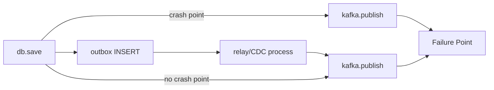
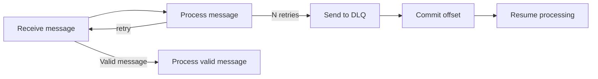
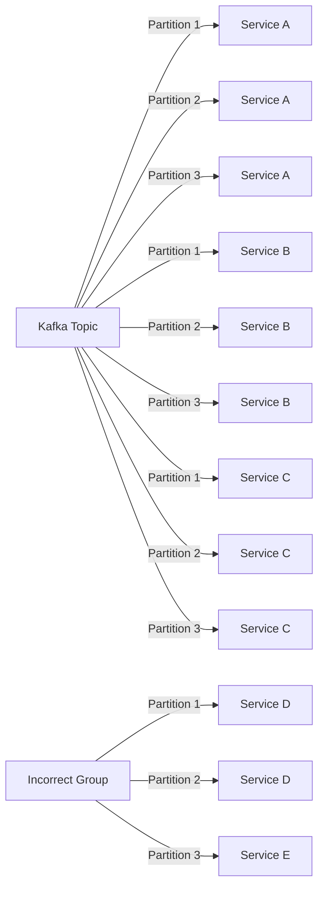

# Five Kafka Design Patterns Every Backend Engineer Should Know

## Clean Code, Broken System: How Kafka Misuse Happens at the Design Level

Kafka is a distributed commit log. Producers append records to topics; consumers read those records independently, each maintaining their own offset into the log. Unlike a traditional message queue, reading a record does not remove it, the data stays on disk for a configured retention period, and many consumers can scan the same topic at entirely different positions and speeds. That single fact distinguishes Kafka from systems like RabbitMQ or SQS at a conceptual level, and it's the source of a class of design mistakes that no amount of clean code can prevent.

Here's the situation that motivates this article: an engineer writes a service that saves an order to a database and then publishes an `OrderCreated` event to Kafka. The code is correct, proper error handling, sensible serialization, a well-named topic. The system ships. Then, under a brief network partition, the database write succeeds and the Kafka write fails. The order exists in the database, but nothing downstream ever hears about it. The dual-write problem just silently corrupted the system state. [1] This kind of bug only surfaces under failure conditions, in production, at the worst possible time. [2]

The root cause isn't bad code. It's treating Kafka as a message queue rather than a log. A queue-shaped mental model leads engineers to reason about producers and consumers as if they share transactional guarantees, consume-once semantics, and delivery that "just works." Kafka provides none of those by default. It provides a durable, ordered, replayable log and a set of building blocks that, when composed with the right design patterns, can achieve exactly those guarantees. Without those patterns, the building blocks are just moving parts with no structural integrity.

Engineers who understand the Kafka API thoroughly can still ship systems with missing events, duplicate processing, and stalled consumer groups that are nearly impossible to reproduce locally. API knowledge is necessary but not sufficient. What bridges the gap is a small set of design patterns, each one targeting a specific failure mode that raw Kafka usage leaves open.

The five failure modes this article addresses are:

1. **Lost events from dual writes**, your database and Kafka can fall out of sync any time two sequential writes aren't atomic.
2. **Poison pill messages**, a single malformed event can stall a consumer indefinitely if the retry loop has nowhere to route failures.
3. **Consumer group interference**, a slow or crashing consumer in one group can mask problems in another when groups share infrastructure carelessly.
4. **State derived from current snapshots**, rebuilding or auditing system state becomes impossible without a durable record of what actually happened.
5. **Non-idempotent processing**, at-least-once delivery is Kafka's default guarantee, so duplicate events will arrive, and consumers that aren't built to handle them will corrupt state.

The five patterns, Outbox, Dead Letter Queue, Consumer Group Isolation, Event Sourcing, and Idempotent Consumer, map onto these failure modes one-to-one. Each section below explains what breaks, why the naive fix makes it worse, and how the pattern resolves it structurally.

## The Outbox Pattern: Database and Kafka in Lockstep

The failure mode is easy to miss because the happy path always works. Your order service saves a confirmed order to the database, then publishes an `OrderConfirmed` event to Kafka. In development, those two lines succeed every time. In production, under load, the database write can succeed and the Kafka publish can fail, and when it does, the order exists in your database while every downstream service remains completely unaware of it. [1] Inventory never reserves the item. The notification service never sends the confirmation email. The bug won't reproduce in staging, because it only surfaces under the exact network conditions that caused the Kafka write to fail after the database commit. [2]

The root cause is that a database transaction and a Kafka publish are two separate systems with no shared coordinator. You cannot wrap them in a single atomic operation without a two-phase commit, and two-phase commit across a relational database and a message broker is a path very few teams want to walk. The dual-write problem, as Confluent's engineering blog calls it, is not a Kafka quirk. It is a structural consequence of writing to two independent systems and expecting them to agree. [1]

The Outbox Pattern resolves this by changing what the application writes to. Instead of calling `kafka.publish()` directly, the service inserts the event as a row into an `outbox` table inside the same database transaction as the domain state change. [3] Both the `orders` row and the `outbox` row either commit together or roll back together. The database's ACID guarantee handles the atomicity that Kafka cannot provide, and the Kafka publish is taken out of the application's transaction boundary entirely.

A separate relay process then reads committed rows from the outbox table and publishes them to the appropriate Kafka topic. In practice, most teams implement this relay using Change Data Capture: a tool like Debezium tails the database's write-ahead log, detects new outbox rows, and streams them to Kafka without the application service needing to know anything about the relay mechanism. [4] SeatGeek's data platform team adopted exactly this stack, Postgres, Debezium, and Kafka, to replace fragile dual-write sequences with a consistent, real-time distribution pipeline. [5]

The result is a structural guarantee: every committed database change will eventually produce a corresponding Kafka event. The relay can retry on transient Kafka failures without risk of inconsistency, because the outbox row stays in the table until the publish is confirmed. The class of bugs where database rows exist without matching events is eliminated at the design level rather than papered over with retry logic in the application layer.

One trade-off worth naming: the outbox table becomes a second write destination on every domain operation, which adds a small but real overhead to your database. On high-volume services, you will want to size the outbox table carefully and ensure the relay process keeps up with inserts so the table does not grow unbounded. That operational cost is almost always worthwhile compared to debugging silent event loss in production.

With writes now consistent between your database and Kafka, the next failure mode moves downstream: what happens when a message arrives at a consumer that cannot process it?



## The Dead Letter Queue: Quarantining Poison Pills Before They Freeze Your Consumers

Kafka's offset model is intentional and elegant right up until a consumer encounters a message it can never process. Because a consumer only advances its offset when it successfully handles a record and commits, a malformed message that throws an exception on every attempt will be retried indefinitely at the same offset, blocking every subsequent message in that partition from ever being seen. This is the poison-pill failure mode: one bad record, and the entire partition stalls.

The mechanics make naive retry loops actively harmful. Each failed attempt is typically logged, so a single poison pill in a high-throughput consumer can fill gigabytes of disk space within minutes before anyone notices. [6] Meanwhile, consumer lag climbs on every downstream service reading from that partition, and whatever SLA backs the pipeline starts to slip. Waiting for topic retention to expire, or manually resetting the consumer group offset, both discard all the healthy messages that arrived after the poison pill. Neither is acceptable in production. [6]

The structural fix is the Dead Letter Queue: a separate Kafka topic that receives any message the consumer cannot process after a configured number of attempts. Once the bad message is written to the DLQ, the consumer commits the original offset and continues with the next record. The pipeline keeps moving, and the poison pill is preserved for investigation rather than discarded.

An important distinction shapes how many retry attempts you allow before routing to the DLQ. Transient failures, a downstream database temporarily unavailable, a rate limit briefly exceeded, deserve a few retries with exponential backoff because the message itself is valid and will succeed once conditions normalize. Persistent failures, invalid JSON, an incompatible schema, a field value that violates a business invariant, will never succeed regardless of how many times you retry them, so routing them to the DLQ immediately saves resources. [7] Conflating the two categories leads either to wasted retries on permanently broken messages or to prematurely discarding messages that would have resolved themselves.

When you route a message to the DLQ, attach context as Kafka headers: the original topic name, the exception class and message, the retry count, and the timestamp of the first failure. [8] Without that metadata, debugging the DLQ is a guessing game. With it, the team investigating the queue can immediately see whether the failures cluster around a schema change, a bad producer deploy, or a downstream service outage, and replay the affected messages once the root cause is fixed.

Kafka Connect provides this out of the box for sink connectors via the `errors.tolerance=all` and `errors.deadletterqueue.topic.name` configuration properties, with `errors.deadletterqueue.context.headers.enable=true` to attach the error headers automatically. [7] For consumer applications that manage their own poll loop, the same outcome requires a try-catch around processing logic, a producer configured to write to the DLQ topic, and an explicit offset commit after the DLQ write succeeds. If you are using Spring Kafka, the `DeadLetterPublishingRecoverer` paired with a `SeekToCurrentErrorHandler` handles the routing and offset management for you. [6]

One operational detail worth getting right from the start: set a longer retention period on DLQ topics than on your main topics. Failed messages often sit there until someone has time to investigate, and losing them from the DLQ before that happens defeats the purpose of capturing them. [7]

The DLQ pattern protects a single consumer from its own poison pills. The next pattern addresses a different failure mode: what happens when multiple consumer groups share the same topic and one slow consumer begins to affect the others.



## Consumer Group Isolation: Preventing One Slow Consumer from Starving the Rest

The previous two sections addressed failures at the boundary between your database and Kafka, and the problem of messages that your consumers cannot successfully process. This section tackles a different class of problem: what happens when multiple services consume the same topic, and one of them starts falling behind?

The short answer is: if those services share a consumer group, they interfere with each other. If they each have their own group, they do not. Understanding exactly why is what makes the isolation guarantee stick.

### How Kafka assigns work inside a group

When consumers share the same `group.id`, Kafka treats them as a pool of workers for a single logical task. [9] Each partition is assigned to exactly one member of the group, and the group's offsets are stored collectively in the internal `__consumer_offsets` topic. [9] That design is intentional for scaling a single service horizontally, but it becomes a trap when you put two logically independent services into the same group.

Imagine an `order-events` topic consumed by both an analytics service and a fulfillment service. If someone configures both to use `group.id = order-processors`, Kafka distributes the partitions between them. A partition given to the analytics service is unavailable to the fulfillment service. If the analytics service slows down or crashes, the partitions it owns stop advancing, and Kafka triggers a rebalance. During that rebalance, all consumers in the group pause. [9] The fulfillment service, which may be processing correctly, gets caught in the blast radius of an entirely unrelated component. 

### The fix: one group per independent consumer

Each downstream service should subscribe with its own unique `group.id`. When you do this, each group receives its own independent copy of every message on the topic and maintains its own offset cursor on every partition. The analytics service and the fulfillment service can both read from `order-events` at completely different rates without any coordination between them. One group accumulating lag has zero effect on the other group's committed offsets. 

```java
// Fulfillment service, owns its entire offset progression independently
Properties fulfillmentProps = new Properties();
fulfillmentProps.put(ConsumerConfig.BOOTSTRAP_SERVERS_CONFIG, "kafka:9092");
fulfillmentProps.put(ConsumerConfig.GROUP_ID_CONFIG, "fulfillment-service-prod");
fulfillmentProps.put(ConsumerConfig.PARTITION_ASSIGNMENT_STRATEGY_CONFIG,
 CooperativeStickyAssignor.class.getName());

// Analytics service, completely separate cursor on the same topic
Properties analyticsProps = new Properties();
analyticsProps.put(ConsumerConfig.BOOTSTRAP_SERVERS_CONFIG, "kafka:9092");
analyticsProps.put(ConsumerConfig.GROUP_ID_CONFIG, "analytics-service-prod");
analyticsProps.put(ConsumerConfig.PARTITION_ASSIGNMENT_STRATEGY_CONFIG,
 CooperativeStickyAssignor.class.getName());
```

Each group gets full access to all partitions. Because Kafka's log is non-destructive, reading does not remove messages, so both groups can scan the same offsets without any contention.

The diagram below shows this arrangement: the same topic with three consumer groups maintaining independent cursors.

{{DIAGRAM:consumer_group_isolation}}

### Naming and rebalance hygiene matter too

A consistent naming convention for `group.id` makes it far easier to spot misconfiguration in lag dashboards. A pattern like `{service}-{environment}-{purpose}` takes seconds to adopt and saves hours of debugging later. [10]

In containerized deployments where pods restart frequently, unnecessary rebalances become another source of interference. Setting `group.instance.id` to a stable per-pod identifier enables static membership: Kafka will wait up to `session.timeout.ms` for that exact instance to rejoin before redistributing its partitions. [9] Combined with the `CooperativeStickyAssignor`, which revokes only the partitions actually being moved rather than stopping every consumer, you can keep most consumers processing through a membership change. [9]

Consumer group isolation solves cross-service interference. What it does not solve is the correctness of what each individual service builds from its stream of events over time, that question belongs to the next pattern.



## Event Sourcing: The Log as the Source of Truth

The drift problem shows up in a specific way: your order service updates an `orders` table to mark an order confirmed, then publishes an `OrderConfirmed` event to Kafka. If the publish fails, your database says confirmed but the event never happened. If you retry carelessly, you may double-fire. The two stores are now candidates for the truth, and the answer to "which one do I trust?" is not obvious.

Event sourcing resolves this tension by removing the question entirely. Instead of storing the current state of an entity in a database and publishing events as a side-channel notification, you store only the sequence of immutable events and derive current state by replaying them. [11] The log is not a mirror of the database. It *is* the database.

**The aggregate/command/event model, briefly.** When a request arrives, your service loads the relevant aggregate (say, an `Order`) by replaying all events keyed to that order's ID from Kafka. The aggregate's `applyEvent` method folds each event into in-memory state. Once rehydrated, the aggregate validates the incoming command against its current state, "can this order be confirmed?", and if valid, produces one or more new events. Those events are appended to the Kafka topic and the in-memory state is discarded. [12] Nothing is ever updated or deleted; corrections are new events. An `OrderCancelled` event reverses an `OrderConfirmed` the way a debit reverses a credit in a ledger.

The partition key is not incidental here. Every event for a given aggregate must land in the same partition so that the consumer always sees events in the order they were written. In practice this means keying your producer records on the aggregate ID, `orderId`, `accountId`, whatever uniquely identifies the entity whose state you're reconstructing.

**Read models are built separately.** Replaying dozens of events every time someone loads a list view is impractical, so event-sourced systems pair the write model with projections: separate consumers that subscribe to the same topic and build denormalized read models in a query store. [12] An `OrderProjectionHandler` listens for `OrderCreated` and `OrderConfirmed` events and maintains a flat `order_summary` table that the API queries directly. The write model and read models are eventually consistent, but they derive from a single authoritative source, the log, so they can never permanently drift. If the read model gets corrupted or its schema needs to change, you drop it and replay from offset zero. 

**Snapshots keep rehydration fast.** An order that has processed thousands of events would be slow to rehydrate from scratch on every write. The snapshot pattern stores a serialized copy of the aggregate state at a specific version, then loads only the events that occurred after that snapshot. [12] A common trigger is every N events, every 100 or 500, depending on event frequency and acceptable rehydration latency. Kafka's compacted topics are a natural fit here: publish the snapshot under the aggregate's key, and log compaction retains only the latest. [11]

The practical trade-offs are real. Schema evolution requires care, because old events sit in the log forever and your `applyEvent` method must handle every version ever written. [12] Eventual consistency means a confirmed order may not appear in the read model immediately, and your UI needs to handle that gracefully. For systems where audit history, temporal queries, or complex state machines are core requirements, order fulfilment, financial transactions, compliance-heavy domains, those trade-offs are well worth making. For a settings table that changes twice a year, they are not.

Event sourcing ensures the log contains the right events in the right order. What it does not guarantee, on its own, is that each event is processed exactly once by every consumer downstream, which is where the next pattern picks up.

## The Idempotent Consumer: Making Duplicate Delivery a Non-Event

Kafka's at-least-once delivery guarantee is not a flaw. It is a deliberate trade-off. When a consumer crashes after processing a message but before committing its offset, Kafka redelivers that message on recovery. This is the right behavior for a durable log; the alternative, skipping the message to avoid redelivery, would be worse. The practical consequence is that your consumer will occasionally receive the same message twice, and your code needs to be ready for it.

For read-only operations this is harmless. For operations with side effects, charging a payment card, inserting an order row, sending a confirmation email, it is not. A consumer that processes every delivery unconditionally will double-charge customers and send duplicate notifications under completely normal failure conditions. Kafka's exactly-once semantics (EOS) configuration reduces the window at the producer-to-broker level, but it does not protect against side effects that reach external systems outside the Kafka transaction boundary. Consumer-side idempotency is required regardless of your EOS setting. 

The structural fix is a deduplication store. Before applying any side effect, your consumer checks whether a unique identifier for that message has already been recorded. If it has, the consumer acknowledges the message and moves on without reprocessing. If it has not, the consumer processes the message and records the identifier atomically with the business operation. The result is what practitioners call "effectively exactly-once": Kafka delivers at least once, and your consumer applies the effect at most once.

The most reliable implementation combines a database unique constraint with a transaction that wraps both the business write and the idempotency record insert together:

```sql
-- Schema
CREATE TABLE processed_messages (
 message_id VARCHAR(255) PRIMARY KEY,
 processed_at TIMESTAMP NOT NULL DEFAULT CURRENT_TIMESTAMP,
 expires_at TIMESTAMP NOT NULL
);

-- Consumer logic (inside a single transaction)
INSERT INTO processed_messages (message_id, expires_at)
VALUES ('order-456-charge', NOW() + INTERVAL '7 days')
ON CONFLICT (message_id) DO NOTHING;

-- rows_affected == 0 means duplicate; skip the charge
-- rows_affected == 1 means new; proceed with the payment insert
```

Because the idempotency insert and the payment insert share the same transaction, a consumer crash mid-processing leaves both uncommitted. On redelivery, the idempotency check finds no record and lets the message through for a clean retry. 

For high-throughput consumers where a database round-trip on every message is too slow, a Redis `SET NX EX` check in front of the database covers the common case in roughly 0.1ms. [13] The key design rule is that Redis functions as a fast cache, not the authoritative record, the database remains the source of truth for durability across Redis restarts.

Two operational details matter more than engineers often expect. First, idempotency keys need a TTL. Retaining keys forever leads to unbounded storage growth; a window that matches your topic's retention period (typically 7 days) is long enough that delayed redeliveries are still caught and short enough that storage stays manageable. [13] Second, the key must come from the producer or be derived deterministically from the message content. A key assigned by the consumer at receive time is a new key on every delivery and defeats the whole mechanism.

---

With all five patterns in place, you have a complete answer to the failure modes this article opened with. Use this as a quick reference when something breaks:

| Failure mode | Pattern to reach for |
|---|---|
| Message published but DB write rolled back | Outbox Pattern |
| Malformed message blocking a partition | Dead Letter Queue |
| One slow consumer starving others | Consumer Group Isolation |
| Reconstructing state after a bug or data loss | Event Sourcing |
| Duplicate delivery causing double charges or inserts | Idempotent Consumer |

The right next step is to pick the one failure mode your current system has already encountered, or the one that would be most costly if it occurred, and add the corresponding pattern first. Each pattern is independently deployable; you do not need all five before any of them pay off. Start with the one whose failure mode keeps you up at night, prove it works under load, then work down the list.

## Sources

1. [Understanding the Dual-Write Problem and Its Solutions](https://www.confluent.io/blog/dual-write-problem)
2. [The Outbox Pattern Explained: Reliable Event Publishing for Microservices - Streamkap](https://streamkap.com/resources-and-guides/outbox-pattern-explained)
3. [Outbox Pattern with Apache Kafka - Axual | Axual Blog](https://axual.com/blog/transactional-outbox-pattern-kafka)
4. [Avoid dual writes in event-driven applications | Red Hat Developer](https://developers.redhat.com/articles/2021/07/30/avoiding-dual-writes-event-driven-applications)
5. [The Transactional Outbox Pattern: Transforming Real-Time Data Distribution at SeatGeek - ChairNerd](https://chairnerd.seatgeek.com/transactional-outbox-pattern)
6. [Beyond the Basics: Can Your Kafka Consumers Handle a Poison Pill?](https://www.confluent.io/blog/spring-kafka-can-your-kafka-consumers-handle-a-poison-pill)
7. [Dead Letter Queues for Error Handling - Conduktor](https://conduktor.io/glossary/dead-letter-queues-for-error-handling)
8. [Poison Pill Problem: Handling Malformed Messages in Kafka](https://www.linkedin.com/posts/app-developer_kafka-systemdesign-dataengineering-activity-7414146335022575616-Lump)
9. [Kafka Consumer Groups Explained | Conduktor](https://conduktor.io/glossary/kafka-consumer-groups-explained)
10. [What is Kafka Consumer Group? | AutoMQ Blog](https://www.automq.com/blog/kafka-consumer-groups-definition-best-practices)
11. [Event Sourcing Patterns with Kafka - Conduktor](https://conduktor.io/glossary/event-sourcing-patterns-with-kafka)
12. [Understanding Event Sourcing: Key Principles and Benefits](https://www.baytechconsulting.com/blog/event-sourcing-explained-2025)
13. [Idempotency & Deduplication - System Design Sandbox](https://www.systemdesignsandbox.com/learn/idempotency-deduplication)