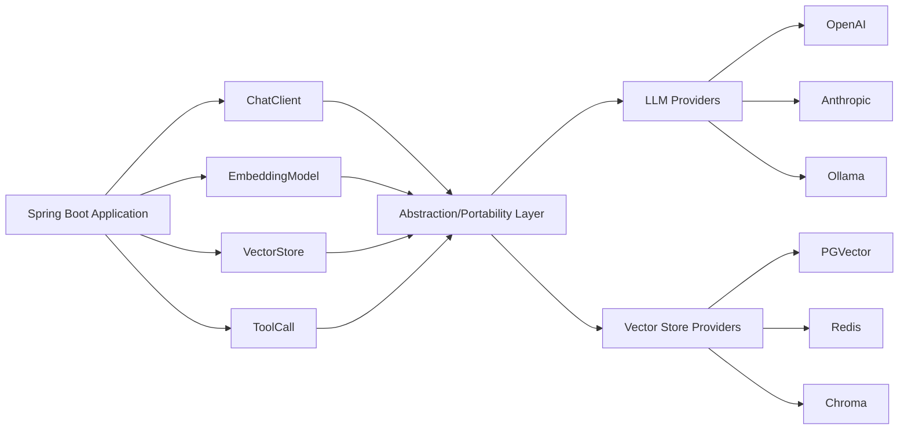
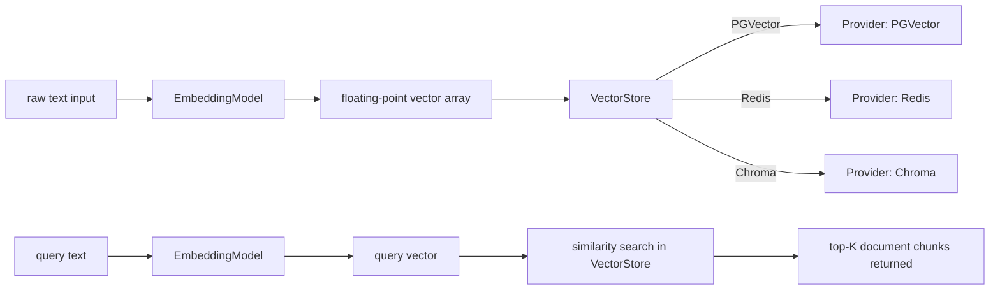
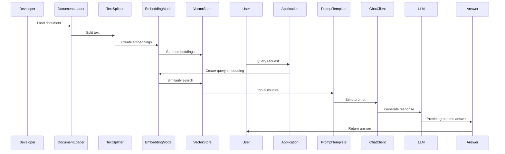
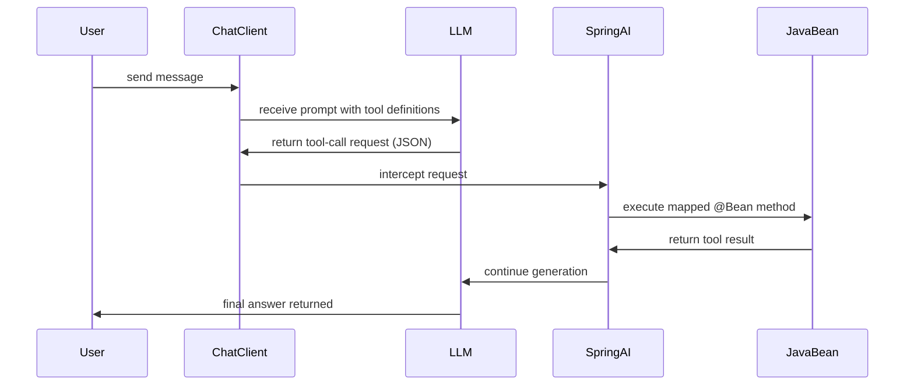

# How Spring AI Works: LLMs, Embeddings, and RAG for Java Engineers

## The Java Engineer's AI Problem, and Why Spring AI Exists

Spring AI is a Spring Boot framework that connects Java applications to LLMs and vector stores using the same dependency-injection patterns Spring developers already know. Your team picks up a ticket to add an AI-powered feature to an existing Spring Boot service, maybe a document Q&A tool, or a chat assistant backed by company-internal data. You open a browser and start searching for tutorials. Nearly every result assumes you are working in Python, reaching for LangChain, and standing up a virtualenv. The code samples use FastAPI. The LLM client libraries are pip packages. The entire mental model is Python-first, and the message, whether intentional or not, is that AI development happens somewhere other than where you work. [1]

This is the friction Spring AI was built to remove. Java is a powerful, deeply established language running enormous amounts of production workloads, and there is no good reason Java engineers should have to detour through a different language just to call a language model. The question "how do I build an AI solution in Java?" deserves a real answer, not "port the Python tutorial yourself." [1]

Spring AI is that answer. It is an application framework for AI engineering whose explicit goal is to carry Spring ecosystem design principles, portability, modular design, and POJO-centric construction, into the AI domain. At its core it solves a concrete integration problem: connecting your enterprise data and APIs with AI models, using the same patterns you already reach for when connecting to a database or a message broker. [2]

The project drew inspiration from Python's LangChain and LlamaIndex, but it is not a port of either. The underlying conviction is that generative AI applications will not stay confined to one language. Spring AI was founded on the belief that the next wave of AI-powered software will be ubiquitous across programming languages, and that Java engineers deserve first-class tooling rather than a translation layer bolted on afterward. 

What makes that practical is the mapping layer Spring AI provides between the AI world and the Spring world. Concepts that feel foreign in isolation, chat models, embeddings, vector stores, prompt templates, tool calls, each get a Spring-native abstraction: an auto-configured bean, a declarative client, a repository interface. You wire them with dependency injection the same way you wire a `JdbcTemplate` or a `RestClient`. The rest of this article walks through how each of those mappings works, how a request travels from your application code through Spring AI to an LLM and back, and how the framework connects to vector databases for retrieval-augmented generation. By the end you should be able to read a Spring AI codebase, understand the event flow it describes, and know exactly which dependency to add for each piece of the puzzle.

## Spring AI's Core Architecture: Familiar Abstractions, New Capabilities

Spring AI is built on three interlocking design principles, and understanding how they stack together explains why the framework feels so natural to a Spring developer. The principles are not independent: each one depends on the one before it, and together they produce something more useful than any of them would alone.

The foundation is **portability**, expressed through a set of provider-agnostic interfaces: `ChatModel`, `EmbeddingModel`, `VectorStore`, `ImageModel`, and so on. Every supported AI provider, OpenAI, Anthropic, Google, Amazon Bedrock, Azure, Ollama, implements the same interfaces. [3] Your application code refers only to these abstractions, never to a provider-specific class. Switching from Claude to GPT-4 means updating a dependency and two lines in `application.properties`; the `ChatModel` you injected into your service doesn't change. [4] That portability only becomes practical, though, if something wires those implementations for you automatically.

That something is **auto-configuration**. Spring AI ships a Spring Boot starter for each supported provider, and adding one to your build is enough for the framework to register a fully wired AI client as a bean. [2] You set `spring.ai.openai.api-key` in `application.properties`, and Spring Boot's auto-configuration creates a `ChatModel`, an `EmbeddingModel`, and a `ChatClient.Builder`, all ready for injection, no manual SDK initialization required. [5] The same mechanism configures vector stores: add `spring-ai-pgvector-store-spring-boot-starter` and the auto-configured `EmbeddingModel` is wired into a `VectorStore` bean automatically. [3] Without the portable interfaces beneath it, this auto-configuration would produce a tangle of provider-specific beans. Because the interfaces are stable contracts, auto-configuration can produce beans that the rest of your application consumes without caring which provider sits behind them.

Those two layers together create the conditions for the third principle: **POJO-centric design**. An LLM response is free-form text, but your service needs typed data. Spring AI's Structured Outputs feature handles the conversion: the `ChatClient` appends a system message instructing the model to respond in JSON, then deserializes the result directly into whatever Java type you specify. [3] The call reads exactly as it would if you were deserializing an HTTP response with `RestClient`:

```java
record City(String name, String zipcode) {}

City capital = chatClient.prompt()
.user("What is the capital of Germany?")
.call()
.entity(City.class);
```

[2] Without portability, you couldn't reuse this pattern across providers. Without auto-configuration, you'd need to manually construct the converter pipeline. The three principles stack, and the stack pays off in code that treats an LLM as just another external data source, one that returns typed objects, gets injected like any other bean, and can be swapped out through configuration.

This layered architecture is what every subsequent Spring AI concept, `ChatClient` prompts, Advisors, RAG pipelines, tool calling, is built on top of. The diagram below shows how these layers relate at runtime, from your Spring beans down through the abstraction interfaces to the provider implementations and external services.



## Talking to LLMs: ChatClient, Models, and Prompt Templates

The first thing most Spring developers want to do when they pick up Spring AI is send a message to an LLM and get a response back. The entry point for that is `ChatClient`, a fluent API that feels instantly familiar if you've ever used `WebClient` or `RestClient`. [6]

Getting there requires three things: the right starter on the classpath, a key in `application.properties`, and an injected `ChatClient`. For OpenAI that looks like this:

```xml
<!-- pom.xml -->
<dependency>
 <groupId>org.springframework.ai</groupId>
 <artifactId>spring-ai-openai-spring-boot-starter</artifactId>
</dependency>
```

```properties
# application.properties
spring.ai.openai.api-key=${OPENAI_API_KEY}
spring.ai.openai.chat.options.model=gpt-4o
```

```java
@Service
public class SupportService {

 private final ChatClient chatClient;

 public SupportService(ChatClient.Builder builder) {
 this.chatClient = builder.build();
 }

 public String answer(String question) {
 return chatClient.prompt()
.user(question)
.call()
.content();
 }
}
```

Auto-configuration registers the `ChatClient.Builder` bean based on whatever provider starter is on the classpath. [6] You inject the builder, call `.build()`, and you're done. Swapping from OpenAI to Azure OpenAI or Mistral is a matter of changing the starter dependency and the corresponding properties, the `ChatClient` call site above stays unchanged. 

That portability comes from the `ChatModel` interface sitting underneath `ChatClient`. Every provider adapter implements `ChatModel`, so the same `call(Prompt)` method signature works regardless of which backend you've configured. You can also inject `ChatModel` directly if you need lower-level access, but for most application code `ChatClient` is the better choice because it layers on convenience methods for streaming, system messages, and chat memory.

### Building structured prompts with PromptTemplate

Simple string questions work fine for exploration, but real features need structure. A customer support bot might need to inject the user's account tier and their most recent order number into every prompt. Hardcoding that with string concatenation gets messy fast. `PromptTemplate` solves this the same way Thymeleaf solves HTML templating: you define a string with named placeholders using `{}` syntax, then fill them at runtime with a `Map`. [6]

```java
PromptTemplate template = new PromptTemplate(
 "You are helping a {tier} customer. Their last order was {orderId}. Answer: {question}"
);

Prompt prompt = template.create(Map.of(
 "tier", "premium",
 "orderId", "ORD-9182",
 "question", userInput
));

Generation result = chatModel.call(prompt).getResult();
```

Under the hood, Spring AI uses the StringTemplate engine by Terence Parr to perform the substitution. [7] If curly braces clash with your template content, you can configure alternate delimiters via `StTemplateRenderer`. [7] You can also store prompt text in classpath resources and inject them with `@Value("classpath:/prompts/support.st")`, which keeps long instructions out of your Java source files entirely. [8]

A `Prompt` can carry multiple `Message` objects, each tagged with a role. The system role gives the model its persona and constraints before the conversation begins; the user role carries the actual question; the assistant role records prior model responses for multi-turn exchanges. [7] Spring AI provides `SystemPromptTemplate` and `UserMessage` as typed helpers for each role, so you rarely work with the raw enum directly. For stateful conversations where the model needs to remember earlier turns, `ChatClient` supports chat memory out of the box, prior messages are automatically included in subsequent calls without manual prompt concatenation. [9]

Once you can send structured prompts to an LLM, the natural next question is how to give it access to your own data. That's where embeddings and vector stores come in.

## Embeddings and Vector Stores: Giving the LLM Long-Term Memory

An embedding is a fixed-length array of floating-point numbers that represents the meaning of a piece of text. [10] When you ask an embedding model to process the sentence "What is the refund policy?", it returns something like a 1536-element vector of decimal values. That vector encodes the semantic content of the sentence, not its exact words. Two sentences that mean the same thing will produce vectors that sit close together in that high-dimensional space, even if they share no vocabulary. [10] That proximity is what makes similarity search possible.

You do not need to understand the mathematics behind this to use it in a Spring application. What matters is the operational picture: you have text, you convert it to a vector, and you store or compare that vector.

### EmbeddingModel: The Spring Abstraction

Spring AI wraps embedding providers behind the `EmbeddingModel` interface, which follows the same design philosophy as `ChatModel`. Auto-configuration wires a provider-specific implementation into your `ApplicationContext`, and your code depends only on the interface. [10] Calling `embeddingModel.embed("some text")` returns a `float[]` at whatever dimensionality the underlying model uses. For batch workloads, `embedForResponse(List<String> texts)` returns all vectors in one round trip, which matters when you are processing thousands of documents at startup.

```java
@Service
public class DocumentIndexer {

 private final EmbeddingModel embeddingModel;

 public DocumentIndexer(EmbeddingModel embeddingModel) {
 this.embeddingModel = embeddingModel;
 }

 public float[] vectorize(String text) {
 return embeddingModel.embed(text);
 }
}
```

Swapping from OpenAI's `text-embedding-ada-002` to a locally hosted Ollama model is a one-line change in `application.properties`. The dimensionality of the output will differ, but the interface stays identical.

### VectorStore: One API, Many Databases

Storing and searching vectors requires a database that understands cosine similarity or dot-product distance. Spring AI introduces `VectorStore`, a single portable interface over a wide fleet of supported backends: PostgreSQL via PGVector, Redis, MongoDB Atlas, Chroma, Milvus, Pinecone, Weaviate, Neo4j, Oracle, Qdrant, Apache Cassandra, and Azure Vector Search. [2]

The API has two primary operations. `vectorStore.add(List<Document> documents)` takes Spring AI `Document` objects, embeds them automatically, and persists the resulting vectors alongside the original text and any metadata you attach. `vectorStore.similaritySearch(SearchRequest.query("refund policy").withTopK(5))` retrieves the five documents whose vectors sit closest to the query vector, returning plain `Document` objects ready to inject into a prompt.

Beyond basic search, Spring AI adds a SQL-like metadata filter syntax that works portably across every supported provider. You can write `SearchRequest.query("refund policy").withFilterExpression("category == 'billing' && year >= 2024")` and the library translates that expression into whatever native filter the underlying store supports, whether that is a Postgres `WHERE` clause or a Pinecone metadata filter object. That portability means you can develop against an in-process Chroma instance and deploy against PGVector in production without changing application code.

### Why These Two Primitives Matter

`EmbeddingModel` converts meaning into numbers; `VectorStore` stores those numbers and finds the closest ones on demand. Together they give an LLM access to knowledge that was never in its training data, your documentation, your customer records, your internal policies. In the next section, those two primitives become the first two steps in a Retrieval-Augmented Generation pipeline that feeds retrieved context directly into the model's prompt.



## RAG Pipelines: Wiring Documents into LLM Answers

Retrieval-Augmented Generation (RAG) is the pattern that closes the biggest gap in stock LLM behavior: a model trained on public data knows nothing about your internal documents, product catalog, or support tickets. RAG solves this by retrieving the relevant text at request time and handing it to the model as context, so the answer is grounded in your data rather than in whatever the model happened to learn during pre-training. Spring AI makes this pattern a first-class citizen, and it maps naturally onto the embedding and vector-store primitives covered in the previous section.

The pipeline splits into two distinct phases. In the ingestion phase you load raw documents, split them into chunks, embed each chunk, and write the resulting vectors into a vector store. In the query phase you embed the user's question, run a similarity search against those vectors to retrieve the top-K most relevant chunks, inject those chunks into the prompt as additional context, and send the augmented prompt to the LLM. Everything between "user typed a question" and "LLM produced a grounded answer" runs inside Spring-managed beans, which means you configure it exactly the way you'd configure a data source or a REST client.

### Ingestion: Loading and Splitting Documents

Spring AI ships a `DocumentReader` abstraction with built-in implementations for PDF, plain text, Markdown, HTML, and JSON. You load documents, pipe them through a `TokenTextSplitter` (or a custom splitter), and call `vectorStore.add(documents)`. The `VectorStore` implementation calls your configured `EmbeddingModel` automatically, you don't wire the embedding call by hand.

```java
@Bean
ApplicationRunner ingest(DocumentReader reader,
 TokenTextSplitter splitter,
 VectorStore vectorStore) {
 return args -> {
 List<Document> docs = reader.get();
 List<Document> chunks = splitter.apply(docs);
 vectorStore.add(chunks);
 System.out.println("Ingested " + chunks.size() + " chunks.");
 };
}
```

Run this once at startup (or on a schedule) and the vector store is ready to serve queries.

### Query: Retrieval and Prompt Augmentation

On the query side, the `QuestionAnswerAdvisor` is the highest-level abstraction Spring AI provides. You attach it to a `ChatClient`, pass in the `VectorStore`, and it handles the retrieve-then-augment flow automatically. The advisor embeds the incoming question, queries the vector store for similar chunks, and rewrites the prompt to include those chunks before the call reaches the model.

```java
@Bean
ChatClient ragClient(ChatClient.Builder builder, VectorStore vectorStore) {
 return builder
.defaultAdvisors(new QuestionAnswerAdvisor(vectorStore))
.build();
}

// At request time:
String answer = ragClient.prompt()
.user(userQuestion)
.call()
.content();
```

The advisor's default behavior retrieves the top four chunks and appends them to the system message. You can tune `k`, apply metadata filters (useful when you've segmented documents by tenant or product line), or replace the default prompt template entirely by supplying your own `PromptTemplate` to the advisor constructor.

### What the Embeddings Are Actually Doing

When the advisor receives a question, it calls `embeddingModel.embed(question)` to produce a vector, then calls `vectorStore.similaritySearch(SearchRequest.query(question).withTopK(4))`. The vector store computes cosine similarity (or an equivalent metric, depending on the backend) between the query vector and all stored chunk vectors, and returns the closest matches. [10] Because the embeddings encode semantic meaning rather than literal keyword overlap, a question about "cancellation policy" will match a chunk that uses the phrase "how to end your subscription", something a keyword search would miss entirely.

The result is a system where your LLM's answers are constrained by evidence drawn from your own documents, which reduces hallucination and keeps the model from confidently citing things it simply doesn't know. For most production Java applications, this is the pattern that makes the difference between a demo and something you'd trust at scale.



## Tool Calling: Letting the LLM Invoke Your Spring Beans

RAG pipelines give the LLM access to stored documents, but documents are static snapshots. When a user asks "what's the current balance on account 4821?" or "book a meeting for tomorrow at 2pm," the model needs to reach into live systems. Tool calling is how that happens.

The core idea is straightforward: instead of answering a question itself, the LLM can pause mid-response and say "I need to call a function to answer this." Spring AI intercepts that signal, executes the corresponding Java method, and sends the result back to the model so it can complete its response. From the user's perspective, the answer just arrives. From the developer's perspective, the model is calling a Spring bean. 

### How the Round-Trip Works

The sequence goes like this: your application sends a prompt along with a list of available tools, each described by name, purpose, and parameter schema. The model evaluates whether any tool is relevant to the request. If it decides to use one, it returns a structured tool-call request rather than a natural-language answer. Spring AI catches that response, looks up the registered Java method by name, deserializes the arguments, invokes the method, and then sends the result back to the model as a follow-up message. The model reads the result and continues generating the final answer. The whole loop is invisible to the caller.

### Registering a Tool

Spring AI lets you register tools in two ways: as annotated beans or as inline lambdas passed directly to the `ChatClient`. The annotation approach maps cleanly to existing service classes:

```java
@Service
public class AccountTools {

 @Tool(description = "Returns the current balance for a given account ID")
 public BigDecimal getAccountBalance(String accountId) {
 return accountRepository.findById(accountId)
.map(Account::getBalance)
.orElseThrow(() -> new IllegalArgumentException("Unknown account: " + accountId));
 }
}
```

You then attach it when building the client call:

```java
ChatResponse response = chatClient.prompt()
.user("What is the balance on account 4821?")
.tools(accountTools)
.call()
.chatResponse();
```

Spring AI reads the `@Tool` annotation to generate the JSON schema the model receives, so the model knows exactly what parameters to pass and what the function does. You do not write any schema by hand.

### Guardrails Around Tool Calls

Because the model is now driving real method invocations, safety controls matter. Spring AI supports input and output guardrails at the model-provider level, which means you can validate what the model is asking to call before the method executes, and you can filter or transform the result before it goes back to the model. In practice this looks like middleware: you intercept the tool-call request, check it against your business rules, and either allow it, reject it with a safe fallback, or modify the parameters. That keeps a misbehaving model from passing malformed inputs straight into your database layer.

Tool calling is also where Spring AI's model portability pays off most noticeably. The same `@Tool`-annotated bean works against OpenAI, Anthropic, Google Gemini, or a local Ollama model. [9] The framework translates the tool schema into whatever wire format each provider expects, so you are not locked into one vendor's function-calling API. Once your tools are registered, switching models is a configuration change, not a rewrite.



## Agentic Patterns: Workflows vs. Autonomous Agents

Tool calling, covered in the previous section, is the mechanism that makes agents possible. The next question is how much control you hand to the LLM once those tools are available.

Spring AI draws a clear line between two types of agentic systems. [11] In a **workflow**, LLMs and tools are orchestrated through predefined code paths, your Java code decides when to call the model, which tools are eligible, and what happens with the result. In an **agent**, the LLM itself dynamically decides which tools to invoke and in what sequence, with your code acting more as an execution host than a director. [11]

The distinction matters practically. A workflow is deterministic by construction: given the same inputs, you follow the same execution path, which makes it easy to test, audit, and explain to stakeholders. An autonomous agent trades that predictability for flexibility, you describe a goal and let the model reason about how to reach it, which is powerful but introduces non-determinism that can be hard to manage in a production system with SLA requirements.

Spring AI's approach here is deliberately aligned with Anthropic's research on building effective agents, which emphasizes simplicity and composability over complex orchestration frameworks. [11] The practical takeaway from that research is that most production use cases are better served by a well-structured workflow than by a fully autonomous agent, even when autonomous agents feel like the more exciting option. Spring AI's `agentic-patterns` reference project implements both styles, giving you concrete starting points for each. 

For a backend Java engineer, this framing maps onto patterns you already know. A workflow resembles a service method with a clear call graph: call the LLM to classify intent, branch on the result, call a tool, return a structured response. An agent resembles an event loop: the LLM produces a tool-call, you execute it, you feed the result back to the model, and you repeat until the model signals it is done. Spring AI handles that loop through its `ChatClient` and tool registration infrastructure, the same APIs you use for single-shot requests, just called iteratively inside a loop that the model controls.

In practice, most teams start with workflow patterns because the control flow is visible in code and failures are easy to reproduce. The agentic loop becomes worthwhile when the task genuinely requires open-ended reasoning, a research assistant that decides which APIs to query based on partial results, for example, or a code-review agent that chooses which static-analysis tools to run based on the languages it detects in a PR. For everything else, the workflow keeps the model in a supporting role and your Java code in the driver's seat, which is usually where you want it in an enterprise context.

## Multi-Model Configuration and Provider Portability

Real enterprise applications rarely settle on a single LLM. You might use a fast, inexpensive model for short classification tasks and a more capable model for complex summarization, or you might want a fallback path so that when one provider's API is unavailable, the application degrades gracefully rather than returning an error. Spring AI handles both scenarios through the same auto-configuration and dependency injection patterns you already use everywhere else in your Spring Boot application.

### Switching Providers With Configuration Alone

The most direct form of portability is the ability to change providers without touching your application code. Because `ChatClient` and `ChatModel` are interfaces, the concrete implementation is determined at startup by whichever starter is on the classpath and how `application.properties` is set. Swapping from OpenAI to Anthropic's Claude is primarily a two-part change: replace the starter dependency in your build file, and update your properties. 

```properties
# OpenAI configuration (active)
spring.ai.openai.api-key=${OPENAI_API_KEY}
spring.ai.openai.chat.options.model=gpt-4o

# Anthropic Claude configuration (alternative, comment out the OpenAI block above
# and uncomment these lines to switch providers; do not use both at once)
# spring.ai.anthropic.api-key=${ANTHROPIC_API_KEY}
# spring.ai.anthropic.chat.options.model=claude-3-5-sonnet-20241022
```

Your `@Service` classes that inject `ChatModel` or `ChatClient` remain untouched. This is the same bet Spring has always made with its abstraction layers: write to the interface, configure the implementation externally.

### Running Multiple Models Side by Side

Provider switching is useful for migration, but some applications need multiple models active at the same time. Spring AI supports declaring multiple `ChatModel` beans in a single application, whether they are from different providers or from the same provider with different settings (say, a large context model alongside a cheaper fast model). 

You wire them using standard Spring qualifier patterns. Declare explicit `@Bean` methods with distinct names, annotate each injection site with `@Qualifier`, and the container routes the right model to each use case.

```java
@Configuration

## Sources

1. [Orchestrating AI Services with the Spring AI Framework - InfoQ](https://www.infoq.com/presentations/spring-ai-framework)
2. [Spring AI](https://spring.io/projects/spring-ai)
3. [Building AI-Driven Applications With Spring AI - JAVAPRO](https://javapro.io/2025/04/22/building-ai-driven-applications-with-spring-ai)
4. [Gen AI with Spring AI - Telusko Docs](https://docs.telusko.com/docs/spring-ai/spring-ai-2.0/gen-ai)
5. [Spring | Generative AI](https://spring.io/ai)
6. [Introduction to Spring AI | Baeldung](https://www.baeldung.com/spring-ai)
7. [Prompts :: Spring AI Reference](https://docs.spring.io/spring-ai/reference/api/prompt.html)
8. [Spring AI PromptTemplate: Creating Prompts (with Examples)](https://howtodoinjava.com/spring-ai/prompt-template-example)
9. [GitHub - ThomasVitale/llm-apps-java-spring-ai: Samples showing how to build Java applications powered by Generative AI and LLMs using Spring AI and Spring Boot. · GitHub](https://github.com/ThomasVitale/llm-apps-java-spring-ai)
10. [AI Concepts :: Spring AI Reference](https://docs.spring.io/spring-ai/reference/concepts.html)
11. [Building Effective Agents with Spring AI (Part 1)](https://spring.io/blog/2025/01/21/spring-ai-agentic-patterns)