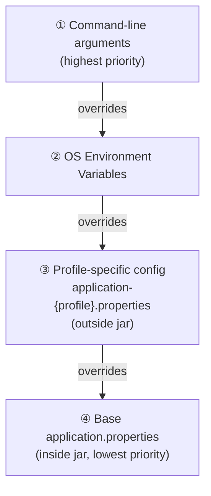
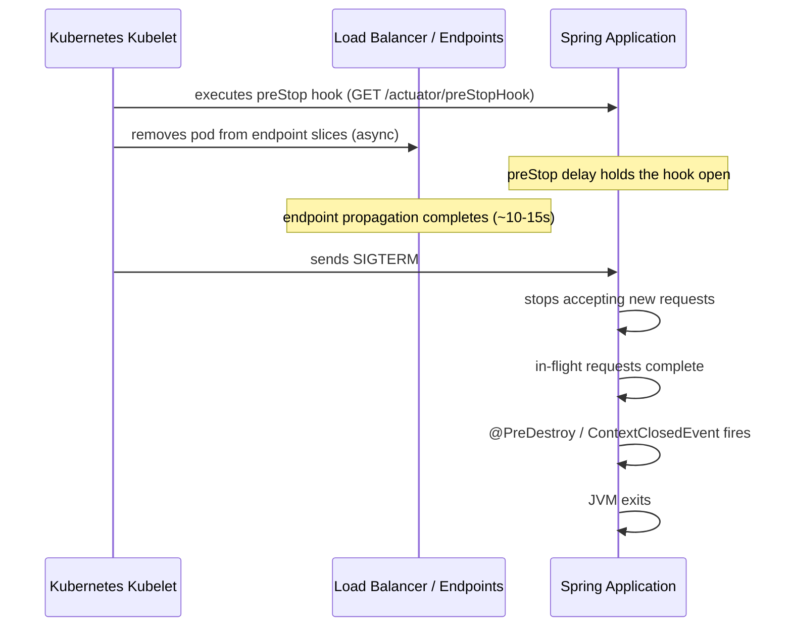
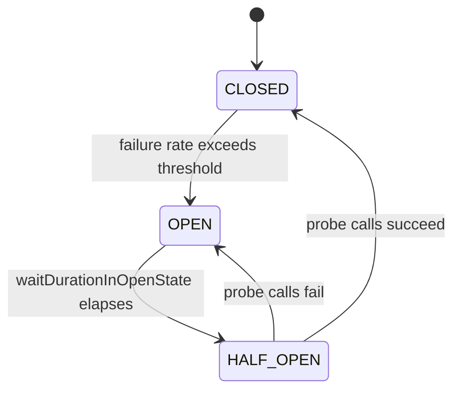

# Five Spring Boot Patterns That Prevent Production Failures: Configuration, Shutdown, Async, Circuit Breaking, and Health Probes

## The Gap Between Tutorial Code and Production Reality

Spring Boot is an opinionated framework for building Java services quickly, it auto-configures your web server, data source, and application context so you can focus on writing business logic rather than plumbing. This article is for engineers who have a Spring Boot service running and want to know which additional patterns separate a service that survives real traffic from one that quietly misbehaves under it.

Consider a concrete example. A downstream API starts responding slowly. Tomcat threads pile up waiting for a response that never comes, because Spring Boot sets no default read timeout. [1] With 60 threads hung on the slow dependency, only 140 of the default 200 remain to serve real traffic, and throughput drops accordingly. [1] In a busier environment, the pool exhausts entirely and the service stops accepting new requests without throwing a single exception.

This failure mode does not appear in any beginner Spring Boot tutorial, and that's not an accident of curriculum design. Tutorials optimize for getting something running. Production optimizes for keeping it running when the environment misbehaves: when a downstream service hangs, when a deployment interrupts in-flight requests, when configuration differs between staging and prod, when a dependency starts failing intermittently overnight.

Five patterns address five distinct categories of that production reality. Externalized configuration with profiles keeps environment-specific values out of your artifact and makes configuration changes auditable and safe. Graceful shutdown with lifecycle hooks ensures that a rolling deployment doesn't drop requests that are mid-flight when the process receives a termination signal. [2] Structured async processing with `@Async` and explicit thread pool configuration moves slow work off the request thread so a sluggish job can't starve the rest of the application. Circuit breaking with Resilience4j gives the service a way to stop calling a dependency that has started failing, rather than letting failures cascade. Health and readiness probes with Actuator tell your orchestration layer whether the service is actually ready to receive traffic, not just whether the process started.

Each of these patterns is already available in the standard Spring Boot dependency tree. None requires a major architectural change. What they require is knowing they exist, understanding what failure they prevent, and wiring them in before traffic is real enough to expose the gap. The rest of this article covers each pattern in turn: what it does, how to configure it, and the specific failure scenario it prevents.

## Pattern 1, Externalized Configuration with Profiles: Eliminating Environment Mismatch

A quieter but common failure happens before the service ever receives real traffic: the application runs fine locally, ships to production, and immediately misbehaves because it's still pointed at the dev database or using in-memory H2 instead of Postgres. The fix isn't discipline alone; it's understanding how Spring Boot resolves configuration values and building your config structure around that resolution order.

Both `.properties` and `.yml` formats are supported for Spring Boot configuration files, and the two are functionally equivalent. The examples below use `.properties` throughout; if your project uses `.yml`, the same keys and values apply with YAML's indentation syntax instead.

Spring Boot 2 evaluates property sources in a well-defined priority order. Command-line arguments sit at the top, overriding everything below them. OS environment variables come next. Below those sit the profile-specific property files, and at the bottom sits the base `application.properties` bundled inside your jar. This layering is the whole point: the jar is immutable, and every environment customizes it by injecting values above the jar's baseline rather than by modifying what's baked in.

Profile-specific files named `application-{profile}.properties` placed *outside* the jar take precedence over their counterparts *inside* the jar. A Kubernetes deployment can mount an environment-specific `application-prod.properties` as a ConfigMap volume, and Spring Boot will pick it up without any code change or rebuild. This is what allows a single deployable artifact to run correctly across dev, staging, and production. 

A typical split looks like this. The base `application.properties` holds values that genuinely don't change across environments:

```properties
# application.properties
spring.application.name=order-service
spring.jpa.open-in-view=false
management.endpoints.web.exposure.include=health,info,prometheus
```

The dev profile keeps things frictionless locally:

```properties
# application-dev.properties
spring.datasource.url=jdbc:h2:mem:orderdb
spring.datasource.driver-class-name=org.h2.Driver
spring.jpa.show-sql=true
logging.level.com.example=DEBUG
```

Production tightens everything down:

```properties
# application-prod.properties
spring.datasource.url=jdbc:postgresql://${DB_HOST}:5432/orderdb
spring.datasource.username=${DB_USER}
spring.datasource.password=${DB_PASSWORD}
spring.jpa.show-sql=false
logging.level.com.example=WARN
```

The prod file deliberately delegates secrets to environment variables using `${...}` placeholders. If `DB_PASSWORD` isn't set at startup, Spring Boot fails fast with a clear error rather than starting with a null password that only fails on the first query.

Profile activation is straightforward. Locally you add `spring.profiles.active=dev` to your IDE run configuration or to a `.env` file. In a container, you set the environment variable `SPRING_PROFILES_ACTIVE=prod`. A command-line override, `--spring.profiles.active=staging`, works for one-off deployments without touching any file.

One thing worth being explicit about: the profile mechanism is not a secret store. Credentials should come through environment variables or a secrets manager like Vault, with the profile file holding only the placeholder reference. Teams that skip this step often end up with database passwords in version control, which is a much worse problem than a misconfigured datasource URL.

With environment mismatch handled, the next failure category is what happens when a pod is killed mid-request, and that requires a different approach entirely.



## Pattern 2, Graceful Shutdown with Lifecycle Hooks: Preventing Dirty Mid-Request Kills

When Kubernetes rolls out a new version of your service, it sends SIGTERM to the old pod. Without any additional configuration, the JVM exits immediately on that signal. Any request that was mid-flight, a database write half-committed, a payment being authorized, a file being streamed, gets cut off at the socket level. The client receives a connection-reset error and has no way to know whether the operation succeeded.

Spring Boot 2.3 introduced built-in graceful shutdown to address exactly this. [2] Enabling it takes two lines in `application.properties`:

```properties
server.shutdown=graceful
spring.lifecycle.timeout-per-shutdown-phase=30s
```

With `server.shutdown=graceful`, the embedded server (Tomcat, Jetty, or Undertow) stops accepting new connections the moment SIGTERM arrives, then waits for active requests to complete before allowing the JVM to exit. [2] The `timeout-per-shutdown-phase` property sets the ceiling: if in-flight requests haven't finished within 30 seconds, Spring proceeds with the shutdown anyway rather than hanging indefinitely. Tune that timeout to match your slowest plausible request, not your average one.

Graceful shutdown handles the HTTP layer, but your application likely has other resources that need orderly cleanup: database connection pools, scheduled jobs mid-execution, Kafka consumer loops, open file handles. This is where `@PreDestroy` and `ContextClosedEvent` earn their place. [3] Annotate a method with `@PreDestroy` and Spring calls it during the bean's destruction phase, after the server has drained. For cross-cutting shutdown logic, flushing a metrics buffer, signaling worker threads to stop, implementing an `ApplicationListener<ContextClosedEvent>` gives you a single, centralized place to coordinate cleanup. 

```java
@Component
public class MetricsFlushListener implements ApplicationListener<ContextClosedEvent> {

 private final MetricsBuffer buffer;

 public MetricsFlushListener(MetricsBuffer buffer) {
 this.buffer = buffer;
 }

 @Override
 public void onApplicationEvent(ContextClosedEvent event) {
 buffer.flush();
 }
}
```

There is one gap that Spring's built-in graceful shutdown cannot close on its own. Kubernetes removes a pod from the service endpoints list asynchronously after sending SIGTERM. There is a brief window, typically a few seconds, where the pod is already refusing new connections but the load balancer is still routing traffic to it. Requests that arrive in that window hit a closed socket. 

The standard mitigation is a Kubernetes `preStop` hook that introduces a deliberate delay before the JVM begins shutting down. In distroless images where `sleep` is unavailable, an Actuator-backed endpoint solves the same problem: a `GET /actuator/preStopHook/{delayInMillis}` endpoint holds the preStop hook open for the specified duration, giving the control plane time to drain the pod from all endpoint slices before SIGTERM actually reaches the application. [4] [4] A delay of 10 to 15 seconds covers most Kubernetes environments; the right value depends on your cluster's endpoint propagation latency.

Once your service shuts down cleanly, the next failure category is what happens during normal operation when a slow downstream dependency starts consuming all your threads.



## Pattern 3, Structured Async Processing with @Async and Thread Pool Tuning: Defeating Thread Starvation

The thread-exhaustion scenario from the introduction had a specific cause: every slow downstream call was blocking a Tomcat worker thread, and the application had no way to offload that work elsewhere. Spring's `@Async` mechanism exists precisely for this situation, but enabling it naively introduces a different failure mode that is just as damaging.

When you add `@EnableAsync` to a configuration class and annotate a service method with `@Async`, Spring wraps the bean in a proxy. Calls to that method from outside the bean are intercepted and submitted to an executor, freeing the calling thread immediately. [5] The Tomcat request thread returns to the pool and can accept the next incoming request while the async work runs separately.

The danger is in which executor Spring uses by default. Without an explicit executor bean, `@Async` falls back to `SimpleAsyncTaskExecutor`, which spawns a brand-new OS thread for every invocation and imposes no upper bound on how many can exist simultaneously. [6] Under load, this trades Tomcat thread exhaustion for JVM thread exhaustion, you get `OutOfMemoryError: unable to create new native thread` instead of a timeout, which is harder to diagnose and just as fatal. [6]

The fix is a named `ThreadPoolTaskExecutor` bean with explicit bounds:

```java
@Configuration
@EnableAsync
public class AsyncConfig {

 @Bean(name = "taskExecutor")
 public Executor taskExecutor() {
 ThreadPoolTaskExecutor executor = new ThreadPoolTaskExecutor();
 executor.setCorePoolSize(10);
 executor.setMaxPoolSize(25);
 executor.setQueueCapacity(200);
 executor.setThreadNamePrefix("async-worker-");
 executor.setRejectedExecutionHandler(new ThreadPoolExecutor.CallerRunsPolicy());
 executor.initialize();
 return executor;
 }
}
```

The three sizing parameters interact in a way that surprises many engineers. [7] The pool starts with `corePoolSize` threads and keeps them alive even when idle. New tasks go to the queue once all core threads are busy. Only after the queue fills up does the pool grow toward `maxPoolSize`. Setting `queueCapacity` to a generous but finite value, 200 in the example above, means excess work is buffered rather than immediately spawning new threads. The `CallerRunsPolicy` rejection handler applies natural back-pressure by running rejected tasks on the submitting thread instead of throwing an exception, so when the pool and queue are both full, the caller slows down rather than failing outright. [8]

One subtlety worth understanding: `@Async` works through Spring's proxy mechanism, which means the proxy is only engaged when the call crosses a bean boundary. If a method inside `NotificationService` calls another `@Async` method on the same `NotificationService` instance via `this.sendEmail(...)`, the proxy is bypassed entirely and the method runs synchronously on the caller's thread. To get async dispatch from within the same class, inject a reference to `self` via `@Autowired` and call through that reference, or move the async method to a separate bean.

With a bounded executor in place, your async service methods look straightforward:

```java
@Service
public class NotificationService {

 @Async("taskExecutor")
 public CompletableFuture<Void> sendEmail(String recipient, String body) {
 // I/O-bound work happens here, off the Tomcat thread
 emailClient.send(recipient, body);
 return CompletableFuture.completedFuture(null);
 }
}
```

Naming the executor explicitly in the annotation (`"taskExecutor"`) avoids any ambiguity if you later define multiple executors for different workloads, such as a separate pool for CPU-intensive tasks versus I/O-bound ones.

Thread pool sizing is not a one-size-fits-all choice. For I/O-bound async work, a larger `corePoolSize` relative to your CPU count makes sense because threads spend most of their time waiting on network or disk. For CPU-bound work, setting `corePoolSize` to roughly the number of available processors prevents context-switching overhead from eating the gains. Exposing `corePoolSize` and `maxPoolSize` through `application.properties` lets you tune these values per environment without redeploying.

Bounded async processing resolves the thread starvation problem, but it does not help when the downstream service you're calling starts returning errors rather than slow responses. That failure mode, a dependency that is up but broken, is where circuit breaking becomes essential.

## Pattern 4, Circuit Breaking with Resilience4j: Stopping Cascading Failures at the Boundary

The previous section showed how unbounded thread pools can cause thread starvation when a downstream call is slow. Circuit breaking is what stops that slow call from becoming everyone's problem. Instead of letting threads pile up waiting for a timeout that may never come, a circuit breaker tracks the error rate of outbound calls and, once failures exceed a threshold, stops making the call at all and returns a fast failure immediately. 

Resilience4j models this with three states. In the **CLOSED** state, calls pass through normally and outcomes are recorded in a sliding window. Once the failure rate inside that window crosses the configured threshold, the breaker transitions to **OPEN**, where every call is rejected immediately with a `CallNotPermittedException`, no network round-trip, no waiting. After `waitDurationInOpenState` elapses, the breaker moves to **HALF_OPEN** and admits a small number of probe requests. If those succeed, the circuit closes again. If they fail, it opens immediately and the timer resets. [9] [9]

To add this to a Spring Boot 3 service, you need three dependencies: the Resilience4j starter, AOP support for the annotations to work, and Actuator for observability. [10]

```xml
<dependency>
 <groupId>io.github.resilience4j</groupId>
 <artifactId>resilience4j-spring-boot3</artifactId>
 <version>2.2.0</version>
</dependency>
<dependency>
 <groupId>org.springframework.boot</groupId>
 <artifactId>spring-boot-starter-aop</artifactId>
</dependency>
<dependency>
 <groupId>org.springframework.boot</groupId>
 <artifactId>spring-boot-starter-actuator</artifactId>
</dependency>
```

Configure the breaker's behavior in `application.yml`. The two parameters that matter most in production are `slidingWindowSize`, how many recent calls are evaluated, and `waitDurationInOpenState`, how long the breaker stays open before probing for recovery. [10]

```yaml
resilience4j:
 circuitbreaker:
 instances:
 paymentService:
 slidingWindowType: COUNT_BASED
 slidingWindowSize: 10
 minimumNumberOfCalls: 5
 failureRateThreshold: 50
 waitDurationInOpenState: 30s
 permittedNumberOfCallsInHalfOpenState: 3
 automaticTransitionFromOpenToHalfOpenEnabled: true
```

On the Java side, annotate the method that crosses the service boundary, the connector or repository layer, not the controller. [11] Pair it with a fallback method that returns a degraded-but-valid response rather than propagating an exception to the caller. 

```java
@Service
public class PaymentConnector {

 private final RestTemplate restTemplate;

 public PaymentConnector(RestTemplate restTemplate) {
 this.restTemplate = restTemplate;
 }

 @CircuitBreaker(name = "paymentService", fallbackMethod = "paymentFallback")
 public PaymentResponse charge(PaymentRequest request) {
 return restTemplate.postForObject(
 "https://fraud-api.example.com/check", request, PaymentResponse.class);
 }

 private PaymentResponse paymentFallback(PaymentRequest request, Exception ex) {
 return PaymentResponse.builder()
.orderId(request.getOrderId())
.status("PENDING_REVIEW")
.message("Payment queued for manual review")
.build();
 }
}
```

The fallback method's signature must match the protected method exactly, with an `Exception` or `Throwable` parameter appended. Get this wrong and Resilience4j will silently fail to wire the fallback, propagating the original exception instead. [11]

One configuration detail worth getting right early: `minimumNumberOfCalls`. Without it, a single failed request at startup can trip a breaker that has only seen one call. Setting it to at least 5 ensures the failure rate is calculated from a meaningful sample before the circuit opens. [12] Similarly, `slowCallDurationThreshold` lets you treat calls that hang for more than, say, two seconds as failures, catching a degraded dependency before it starts actively returning errors. [12]

Resilience4j publishes circuit breaker state through Actuator automatically when you enable it. In `application.yml`, expose the `circuitbreakers` and `health` endpoints and set `management.health.circuitbreakers.enabled: true`. A GET to `/actuator/circuitbreakers` will show the current state, failure rate, and buffered call count for each named instance, useful for confirming that a circuit has opened in production before you start chasing logs. [10]

Circuit breaking solves the cascading-failure problem, but it only helps if you can see when it fires. The next section covers how Actuator health and readiness probes make that degradation visible to both your orchestration layer and your on-call team.



## Pattern 5, Health and Readiness Probes with Actuator: Making Degradation Visible

A Spring Boot service can be simultaneously "running" and completely broken. The JVM is up, the process responds to pings, Kubernetes sees a healthy pod, and every request returns a 500 because the database connection pool was exhausted twenty minutes ago. Without health probes, this failure is invisible to the platform, and all it can do is keep routing traffic into the problem.

Spring Boot Actuator addresses this by exposing `/actuator/health`, `/actuator/health/liveness`, and `/actuator/health/readiness` as structured endpoints that aggregate the status of every registered health indicator, database, message broker, disk space, Redis, and more, into a single machine-readable response. The overall status follows a logical AND: if any one component reports DOWN, the aggregate reports DOWN and returns HTTP 503.

The liveness and readiness distinction matters in practice. A liveness probe should be narrow, checking only that the JVM is responsive, not that downstream dependencies are healthy. If your liveness probe checks the database and the database has a thirty-second hiccup, Kubernetes will restart the pod, which does nothing to fix the database and adds unnecessary churn. [13] The readiness probe is where you add dependency checks, because a NOT READY pod is simply removed from the service's endpoint list rather than restarted. Traffic stops arriving; the pod stays alive and recovers when the dependency comes back. [13]

Enable both probe endpoints explicitly in `application.yml`:

```yaml
management:
 endpoint:
 health:
 show-details: always
 probes:
 enabled: true
 group:
 liveness:
 include: livenessState
 readiness:
 include: readinessState,db,diskSpace
 health:
 livenessstate:
 enabled: true
 readinessstate:
 enabled: true
```

Then point your Kubernetes deployment at the right paths:

```yaml
livenessProbe:
 httpGet:
 path: /actuator/health/liveness
 port: 8080
 periodSeconds: 10
 failureThreshold: 3
readinessProbe:
 httpGet:
 path: /actuator/health/readiness
 port: 8080
 periodSeconds: 5
 failureThreshold: 3
startupProbe:
 httpGet:
 path: /actuator/health/liveness
 port: 8080
 initialDelaySeconds: 10
 periodSeconds: 5
 failureThreshold: 30
```

A startup probe is worth treating as required for Spring Boot on Kubernetes. Java applications routinely need 30-60 seconds to initialize, and without one, Kubernetes may declare the pod broken before the application context has even finished loading. The startup probe above allows up to 150 seconds for initialization; after it passes, the liveness probe takes over.

Actuator also lets you expose your own health logic. Implement `HealthIndicator`, annotate it with `@Component`, and Spring will automatically include it in the aggregated response. The bean name minus the "HealthIndicator" suffix becomes the key in the JSON output, so `DatabaseHealthIndicator` appears as `"database"` in the response.

---

### Go-Live Checklist: Which Patterns to Add First

The order depends on what kind of service you are shipping.

**Synchronous HTTP service (REST API, BFF, gateway)**

1. Externalized configuration with profiles, environment parity prevents the entire class of "works locally, broken in prod" incidents.
2. Graceful shutdown, prevents in-flight requests from being killed on every deploy.
3. Circuit breaking with Resilience4j, protects your thread pool from slow downstream APIs.
4. Actuator health and readiness probes, makes degradation visible to load balancers and on-call engineers.

**Async worker or event-driven service (Kafka consumer, job processor)**

1. Externalized configuration with profiles.
2. `@Async` with a bounded `ThreadPoolTaskExecutor`, an unbounded executor will exhaust memory under sustained load.
3. Actuator health probes, at minimum, expose readiness so the pod can signal when it has fallen behind or lost its broker connection.
4. Graceful shutdown, give in-flight messages time to complete before the consumer stops.

**Any service deploying to Kubernetes**

All five patterns apply, but start with readiness probes and graceful shutdown together. A pod that starts receiving traffic before its connection pool is ready, or that gets killed mid-request on every rolling deploy, will produce incidents that are genuinely hard to debug, because the failure window is short and the logs look normal. 

The fastest path forward: add `spring-boot-starter-actuator` to your dependencies today, enable the probe endpoints, and wire the Kubernetes manifest to `/actuator/health/liveness` and `/actuator/health/readiness`. That single change makes your service's internal state legible to the platform, and legibility is the prerequisite for everything else.

## Sources

1. [Spring Boot Performance: Avoid Default Config Pitfalls – The Perf Parlor](https://theperfparlor.com/2025/07/18/spring-boot-performance-avoid-default-config-pitfalls)
2. [GitHub - gesellix/graceful-shutdown-spring-boot: Graceful Shutdown with Spring Boot (Demo) · GitHub](https://github.com/gesellix/graceful-shutdown-spring-boot)
3. [🔄 Understanding Spring Boot Lifecycle Hooks: From Bean Creation to Application Ready - DEV Community](https://dev.to/devcorner/understanding-spring-boot-lifecycle-hooks-from-bean-creation-to-application-ready-380k)
4. [GitHub - upmc-enterprises/graceful-shutdown-spring-boot-starter · GitHub](https://github.com/upmc-enterprises/graceful-shutdown-spring-boot-starter)
5. [Understanding @Async Annotation in Spring Boot](https://www.hungrycoders.com/blog/understanding-async-annotation-in-spring-boot)
6. [How to prevent OutOfMemoryError when you use @Async - CraftingJava](https://craftingjava.com/blog/prevent-oome-async)
7. [ThreadPoolTaskExecutor corePoolSize vs. maxPoolSize | Baeldung](https://www.baeldung.com/java-threadpooltaskexecutor-core-vs-max-poolsize)
8. [Configure the Spring ThreadPoolTaskExecutor. - Tim](https://codingtim.github.io/spring-threadpooltaskexecutor)
9. [Circuit breaker design pattern - Wikipedia](https://en.wikipedia.org/wiki/Circuit_breaker_design_pattern)
10. [How to Implement Circuit Breakers with Resilience4j in Spring](https://oneuptime.com/blog/post/2026-01-25-circuit-breakers-resilience4j-spring/view)
11. [Fault Tolerance with Resilience4j and Spring Boot - j-labs](https://www.j-labs.pl/en/tech-blog/fault-tolerance-with-resilience4j-and-spring-boot)
12. [Circuit Breaker Pattern for Resilient Systems](https://dzone.com/articles/circuit-breaker-pattern-resilient-systems)
13. [How to Build Health Probes for Kubernetes in Spring Boot](https://oneuptime.com/blog/post/2026-01-25-health-probes-kubernetes-spring-boot/view)