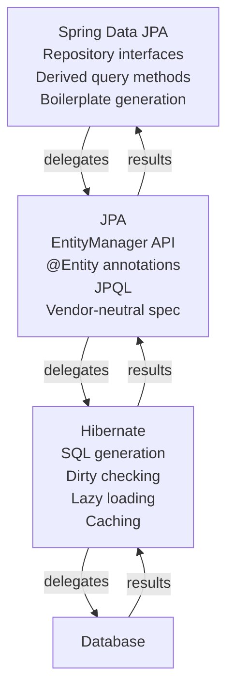
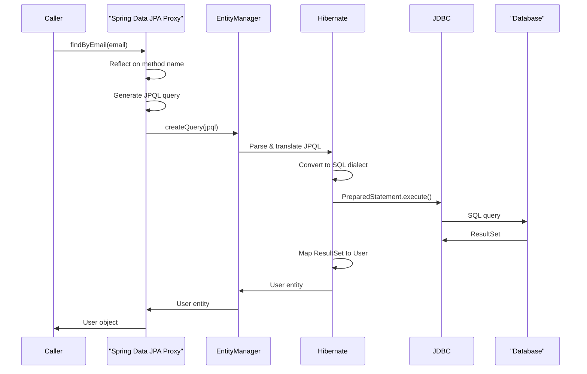

# How Spring Data JPA, JPA, and Hibernate work together

## The Magic Line That Raises the Right Question

Spring Data JPA is a library that lets you query a relational database by writing a Java interface method and nothing else. No SQL, no `ResultSet` parsing, no `PreparedStatement` boilerplate. You declare what you want, and the framework figures out how to fetch it.

Here is the moment that stops most backend engineers in their tracks:

```java
public interface UserRepository extends JpaRepository<User, Long> {
 Optional<User> findByEmail(String email);
}
```

That is the entire implementation. You inject `UserRepository` into a service, call `userRepository.findByEmail("alice@example.com")`, and get back a populated `User` object from the database. [1] The method works on the first try, which is satisfying until something breaks, or until you need to understand why a query is slow, why a `LazyInitializationException` keeps appearing, or why your transaction did not roll back the way you expected.

At that point, the magic stops feeling helpful and starts feeling like a wall.

The wall exists because `findByEmail` is not a single thing. It is the visible surface of three separate layers, each with its own responsibilities, its own failure modes, and its own configuration surface. Spring Data JPA translated your method name into a query. JPA, the Java Persistence API, provided the standard contract that query had to follow. Hibernate actually executed it against the database. Without knowing which layer owns which job, you cannot know which layer to look at when something goes wrong.

To answer why that one line works, you need a clear picture of all three layers. That is what the rest of this article builds.

## Three Layers, Three Jobs: The Stack in One Mental Model

When you call `findByEmail("alice@example.com")` on a repository interface you never implemented, what actually runs? The answer involves three distinct layers, each with a single clear job, and conflating any two of them is the source of most of the confusion engineers run into.

At the bottom sits **Hibernate**. Hibernate is a full ORM framework. It owns a `SessionFactory`, manages an in-memory representation of your entities, generates SQL, and fires that SQL over JDBC to the database. [2] When things go wrong at the database level, a bad join, an unexpected number of queries, a lazy-loading exception, Hibernate is the layer to examine.

In the middle sits **JPA** (Java Persistence API). JPA is not a library you can download and run; it is a specification, a set of interfaces, annotations, and contracts that any compliant ORM must honour. [3] It defines what `@Entity`, `@OneToMany`, and `EntityManager` mean, but it ships no implementation of its own. Hibernate is Spring Boot's default JPA provider, meaning Hibernate is the concrete code that fulfils those contracts. [2] This distinction matters because your annotations belong to JPA, while the SQL they produce belongs to Hibernate.

At the top sits **Spring Data JPA**. Its sole job is eliminating boilerplate in the data-access layer. [1] You write a repository interface; Spring generates a proxy implementation at startup that translates method names and annotations into JPA operations. [1] Spring Data JPA does not talk to your database directly, and it is not itself an ORM. Every call it receives flows downward through JPA's `EntityManager` and on into Hibernate, which finally issues the JDBC call. 

Laid out as a delegation chain, the flow looks like this:

```
Your code
 → Spring Data JPA (repository proxy)
 → JPA EntityManager (standard contract)
 → Hibernate (SQL generation + JDBC)
 → Database
```

Each arrow in that chain crosses a responsibility boundary. Spring Data JPA knows about Spring conventions and method-name patterns. JPA knows about entities and persistence context lifecycle. Hibernate knows about SQL dialects and connection pooling. None of the three layers were designed to do each other's jobs, which is exactly why each one is replaceable in theory. You could swap Hibernate for EclipseLink and keep all your JPA annotations untouched, or swap Spring Data JPA for plain `EntityManager` calls and keep Hibernate doing exactly what it already does.

Keeping this map in your head pays off the moment something goes wrong. A `LazyInitializationException` is a Hibernate story. A `@Transactional` annotation that seems to do nothing is a Spring story. A repository method that generates a query you didn't expect is a Spring Data JPA story, though Hibernate ultimately executes it. The next three sections go bottom-up through the stack, starting with the layer that actually touches your database.



## Hibernate: The Engine That Actually Talks to the Database

When your Spring application saves an entity and a SQL `INSERT` appears in the logs, Hibernate wrote that statement. It is an Object-Relational Mapping framework whose single job is bridging the gap between Java objects and relational tables, translating method calls and object state into the SQL your database actually understands, so you don't have to hand-write every query for routine CRUD operations. [2]

At the center of Hibernate's runtime is the `SessionFactory`, a heavyweight, thread-safe object built once at application startup. From that factory, Hibernate creates per-request `Session` instances (or, in the JPA vocabulary you'll see more often in Spring code, `EntityManager` instances). Those per-request objects are not thread-safe, so Spring handles their lifecycle carefully. The `EntityManager` you inject with `@PersistenceContext` is actually a thread-bound proxy that delegates to whichever transactional `EntityManager` is currently active for that request, falling back to a freshly created one if no transaction is in progress. [4] That indirection is invisible in normal usage but matters when you start debugging concurrency issues.

Several behaviors that surface as runtime surprises are owned entirely by Hibernate, not by the layers above it. 

**Dirty checking** is one of the most useful and least understood. Inside an active transaction, Hibernate holds a snapshot of every entity it has loaded. When the transaction commits, it compares current field values against those snapshots and issues `UPDATE` statements automatically for anything that changed, even if you never called `save()`. This is a feature, but it confuses engineers who expect no SQL to run unless they explicitly persist something.

**First-level cache** (the session cache) means that within a single `EntityManager` lifetime, calling `find(User.class, 1L)` twice returns the same Java object from memory on the second call, with no second database round-trip. This cache is scoped to the session, not the application, so it disappears when the session closes.

**Lazy loading** lets Hibernate defer fetching associated collections until your code actually accesses them. A `User` with a `@OneToMany` list of `Orders` won't load those orders until you call `user.getOrders()`. The downside is the N+1 problem: if you load 50 users in a list and then touch `.getOrders()` for each one inside a loop, Hibernate fires one query to fetch the users and then 50 separate queries to fetch each user's orders. The fix usually involves a `JOIN FETCH` in your query or switching the fetch type, but the first step is recognizing that Hibernate is what's generating those 50 extra statements.

**SQL dialect translation** means Hibernate handles the differences between database engines. You configure `spring.jpa.database-platform` to point at a dialect class, and Hibernate adapts its generated SQL to match the syntax of PostgreSQL, MySQL, Oracle, or whatever you're running.

All of these behaviors, dirty checking, caching, lazy loading, dialect generation, live at the Hibernate layer. When something breaks, the explanation usually lives there too. The layer above it, JPA, doesn't implement any of this; it just defines the contract that Hibernate must honor.

## JPA: The Standard Contract Every ORM Must Honor

The previous section covered what Hibernate actually does at runtime. But if you look at a typical Spring Boot entity class, you'll notice the imports don't say `org.hibernate.*`. They say `jakarta.persistence.*` (or `javax.persistence.*` on older versions). That's JPA, and understanding why it's there clarifies the whole stack.

JPA, the Jakarta Persistence API, is a specification, not a library you run. It defines a set of interfaces, annotations, and rules that any compliant ORM must implement. [2] The annotations you use every day, `@Entity`, `@Id`, `@OneToMany`, `@Column`, are all defined by JPA. The central API for interacting with the persistence context, `EntityManager`, is also defined by JPA, with methods like `persist`, `find`, `merge`, and `remove`. Hibernate is simply the most popular implementation of that contract.

This separation matters practically. Because your application code targets JPA interfaces rather than Hibernate-specific classes, you could swap Hibernate for EclipseLink or OpenJPA and recompile without touching your entity or service code. In practice, most teams never make that swap, but portability isn't the only benefit. The bigger win is that JPA gives the whole Java ecosystem a shared vocabulary. Documentation, Stack Overflow answers, and framework libraries all speak JPA, even when each is backed by a different provider.

JPA also introduced JPQL, the Java Persistence Query Language, which lets you query against entity class names and field names rather than table and column names. A JPQL query looks like this:

```java
TypedQuery<Order> query = entityManager.createQuery(
 "SELECT o FROM Order o WHERE o.customer.email =:email", Order.class
);
query.setParameter("email", "alice@example.com");
List<Order> orders = query.getResultList();
```

Compare that to raw JDBC, where you would write a SQL string against `orders.customer_email`, manually open a `ResultSet`, and map each column back to a field by hand. [5] JPQL keeps queries at the object level, so renaming a Java field and its corresponding column mapping stays in one place rather than scattered across SQL strings throughout the codebase.

The honest limitation of plain JPA is that it still requires you to wire up an `EntityManagerFactory`, manage `EntityManager` lifecycles, write those `createQuery` calls, and handle transactions explicitly. For a small application that's manageable. For a service with thirty entity types and hundreds of queries, it becomes a lot of repeated structural code. That gap is exactly what Spring Data JPA was designed to close.

## Spring Data JPA: The Boilerplate Eliminator on Top

With the JPA specification and Hibernate's implementation both accounted for, the question that opened this article is still hanging: where exactly does `findByEmail()` come from? You never wrote a SQL query, never touched an `EntityManager`, never defined a concrete class. The answer lives entirely in Spring Data JPA's repository abstraction.

When your application starts up, Spring Data JPA scans for interfaces that extend `JpaRepository` (or one of its parent interfaces) and generates concrete implementations on the fly. [1] No DAO class needs to be written, because Spring creates a proxy object that wires in the actual behavior at startup, before any request arrives. That proxy is what gets injected into your service layer when you use `@Autowired` or constructor injection.

The method-name translation is the part that feels most like magic. Spring Data JPA parses the method signature using reflection, breaks it down by the keywords it recognizes (`findBy`, `And`, `Or`, `OrderBy`, `Between`, and so on), and constructs a JPQL query to match. A method named `findByLastNameAndAgeGreaterThan` becomes something like `SELECT u FROM User u WHERE u.lastName =:lastName AND u.age >:age`, assembled at startup rather than at call time. If you make a typo in the method name that produces an unresolvable expression, the application will fail to start, not fail at 2 AM when that code path is first hit in production.

```java
public interface UserRepository extends JpaRepository<User, Long> {
 List<User> findByLastName(String lastName);
 Optional<User> findByEmail(String email);
 List<User> findByAgeGreaterThanOrderByLastNameAsc(int age);
}
```

That is the entire file. Spring Data JPA does the rest.

When one of these methods is called at runtime, the proxy delegates to a `SimpleJpaRepository` implementation under the hood, which in turn uses a JPA `EntityManager` to execute the translated query. That `EntityManager` call flows down to Hibernate, which generates the SQL and sends it to the database. The call chain traverses all three layers: your repository interface, the JPA `EntityManager`, and Hibernate's SQL engine.

Spring Data JPA is part of the broader Spring Data umbrella project, which applies the same repository abstraction pattern to MongoDB, Redis, Cassandra, and other stores. Switching from a relational database to MongoDB doesn't require learning an entirely different programming model. You extend a MongoDB-specific repository interface and the query derivation works the same way. That consistency is the deeper goal of Spring Data JPA's design.

Derived query methods cover a large surface area, but they are not the only option. For anything complex, `@Query` lets you write JPQL (or even native SQL with `nativeQuery = true`) directly on the method. The proxy mechanism stays in place; only the query source changes. This means you can stay in the repository interface without writing any implementation code, even for queries that method-name derivation cannot express cleanly.

Knowing which layer owns which behavior is immediately useful when things go wrong.



## When the Magic Breaks: Debugging Across the Three Layers

Each failure mode has a home layer, and pointing your debugger at the wrong one wastes time.

**`LazyInitializationException`, Hibernate's session is closed**

This exception means Hibernate tried to load a lazy association, looked for an open persistence context, and found none. [4] It is a Hibernate-layer error about session lifecycle, not a Spring Data JPA bug. The usual cause is accessing a `@OneToMany` collection after the repository method has returned and the `EntityManager` has closed. [2] Fix it at the layer that owns sessions: either annotate the calling service method with `@Transactional` so the persistence context stays open while you traverse the association, or switch the fetch type to eager for relationships you always need. A third option is a JPQL `JOIN FETCH` or `@EntityGraph` on the repository method itself, which tells Hibernate to load the association in the initial query rather than deferring it.

**Unexpected query count, Hibernate's lazy-loading strategy**

If your application issues far more SQL statements than you expect, the N+1 problem is the likely culprit. Hibernate's default for `@OneToMany` is `FetchType.LAZY`, so fetching ten authors and iterating their posts triggers one query for the author list and ten more for the post collections. [6] You won't see this in your repository interface, you have to look at what Hibernate is generating. Enable SQL logging with these two lines in `application.properties`:

```properties
spring.jpa.show-sql=true
logging.level.org.hibernate.SQL=DEBUG
```

Once you can see the queries, the fix is at the Hibernate or JPA layer, not the Spring Data layer. A `JOIN FETCH` in a `@Query` annotation collapses the N+1 into a single join. [6] `@EntityGraph` on the repository method achieves the same result declaratively. [6] For cases where you prefer to keep lazy loading but still want fewer round trips, setting `spring.jpa.properties.hibernate.default_batch_fetch_size=10` tells Hibernate to load related collections in batches with an `IN` clause rather than one query per row. [6]

**Transaction rollback surprises, Spring's `@Transactional` infrastructure**

When a transaction does not behave the way you expect, changes not persisting, rollbacks firing on the wrong exception, or operations on a second data source not participating in the transaction, the problem lives at the Spring layer. `@Transactional` is managed entirely by Spring's AOP proxy, and its default behavior is to roll back only on unchecked exceptions. If your application has multiple data sources, Spring applies `@Transactional` to the primary one by default; the secondary data source participates only if you configure a `JtaTransactionManager` or explicitly name the transaction manager in the annotation. [7] The fix is a Spring configuration change, not a Hibernate tuning exercise.

The mental model from earlier sections makes all three of these straightforward to triage: session lifecycle is Hibernate, query shape is Hibernate, transaction boundaries are Spring. When you see a stack trace or unexpected behavior, ask which layer owns that concept, then inspect or configure exactly that layer. Turning on SQL logging in development is a good habit regardless, the raw queries Hibernate sends are the single most informative signal available, and most performance surprises reveal themselves within a few minutes of reading them.

## Sources

1. [Spring Data JPA](https://spring.io/projects/spring-data-jpa)
2. [JPA, Hibernate And Spring Data JPA](https://medium.com/@burakkocakeu/jpa-hibernate-and-spring-data-jpa-efa71feb82ac)
3. [Difference Between JPA and Spring Data JPA | Baeldung](https://www.baeldung.com/spring-data-jpa-vs-jpa)
4. [JPA :: Spring Framework](https://docs.spring.io/spring-framework/reference/data-access/orm/jpa.html)
5. [A Comparison Between JPA and JDBC | Baeldung](https://www.baeldung.com/jpa-vs-jdbc)
6. [Understanding and Solving the N+1 Problem in Spring Data JPA - DEV Community](https://dev.to/sadiul_hakim/understanding-and-solving-the-n1-problem-in-spring-data-jpa-2b6f)
7. [java - What's the difference between Hibernate and Spring Data JPA - Stack Overflow](https://stackoverflow.com/questions/23862994/whats-the-difference-between-hibernate-and-spring-data-jpa)