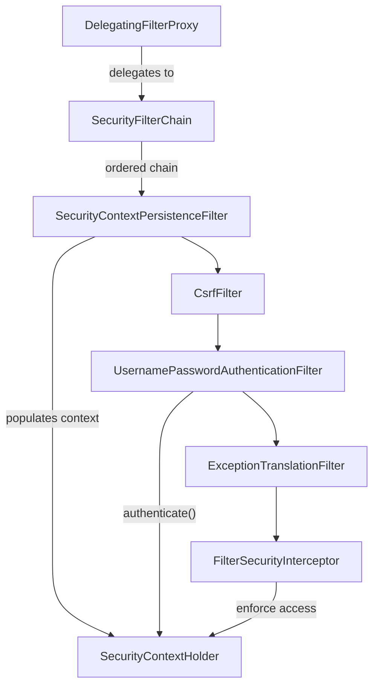
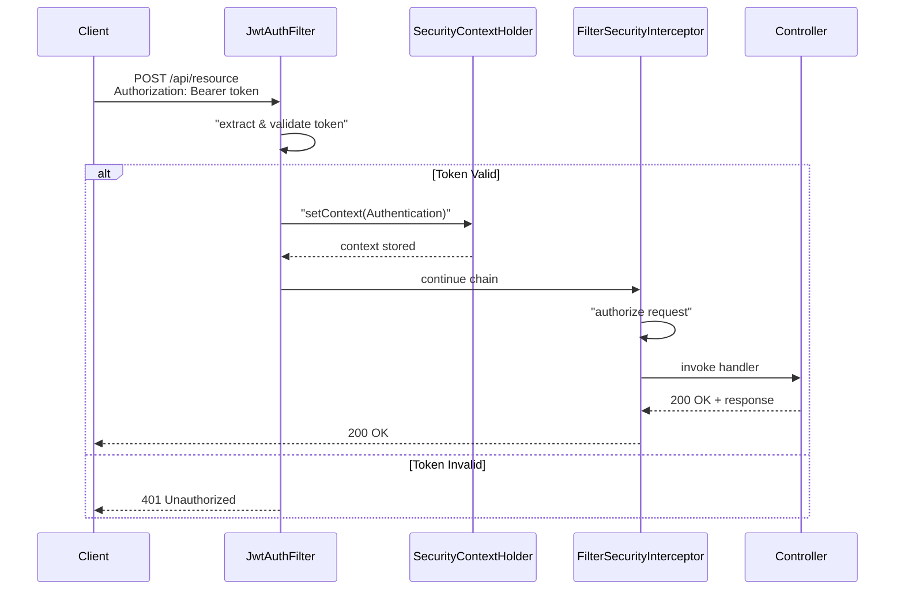
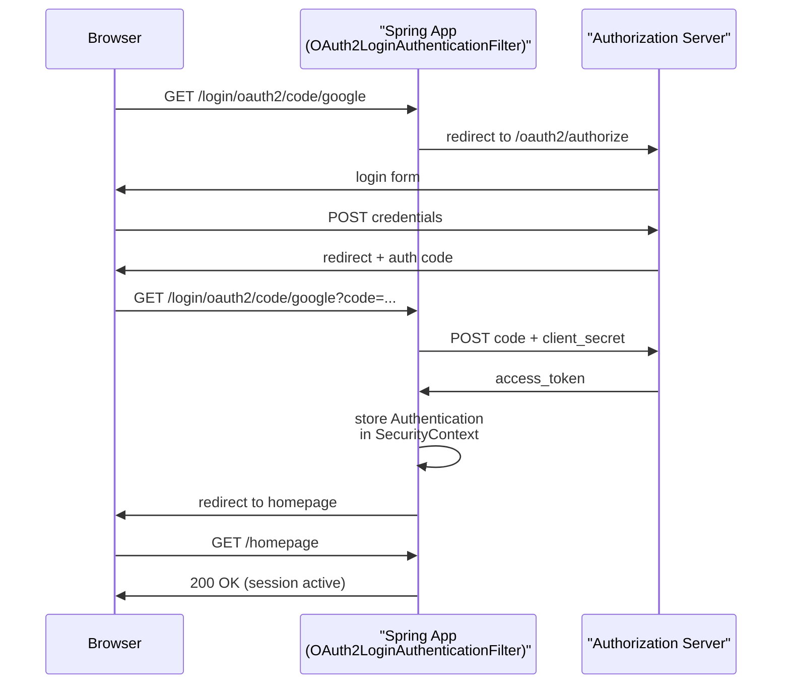
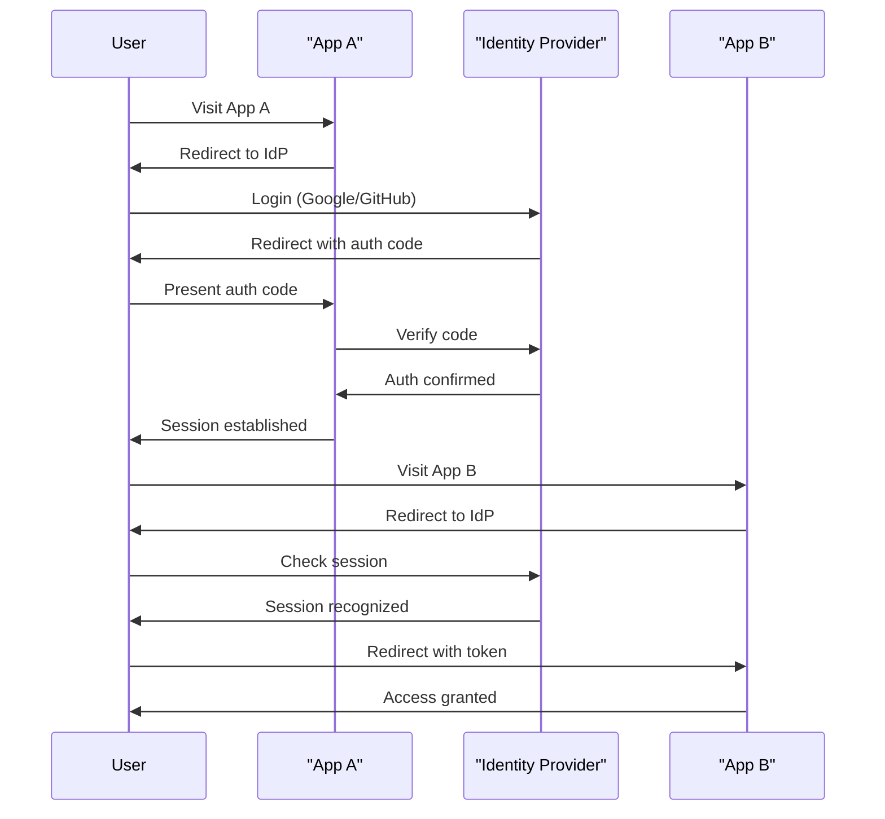

# How Spring Security works with JWT, OAuth2, and SSO

## The 401 You Never Wrote: What Spring Security Actually Does Out of the Box

Spring Security is a framework that intercepts every HTTP request entering your application and enforces authentication and authorization rules before that request ever reaches a controller. You do not write the interception logic yourself, adding the `spring-boot-starter-security` dependency to a Spring Boot project is enough to activate a default configuration that locks down every endpoint and returns a 401 (or redirects to `/login`) for any unauthenticated caller. No annotations, no filters, no `@PreAuthorize`, just a single dependency, and suddenly your previously open API is asking for credentials.

That out-of-the-box behavior surprises a lot of engineers the first time they see it, but it reflects a deliberate design choice: security should be the default, not something you opt into. The alternative, checking credentials inside each controller method, means one forgotten check equals one unprotected route. Spring Security removes that category of mistake entirely by applying rules uniformly at the HTTP layer, before a single line of your business logic runs. 

What makes this possible is the **security filter chain**. Spring Security is not a single interceptor sitting in front of your application; it is a carefully ordered sequence of servlet filters, each responsible for one concern. One filter handles CSRF token validation. Another manages session creation and lookup. Another reads the `Authorization` header and tries to resolve a credential. Another checks whether the resolved identity actually has permission to reach the requested URL. These filters run in a fixed order on every incoming request, and each one can either pass the request downstream or short-circuit the chain with an error response.

At the center of this pipeline sits the `SecurityContext`. By the time the authorization filters run, the chain expects someone to have placed an `Authentication` object into the context, a wrapper that holds the verified identity (the *principal*) and the roles or authorities it carries. If the context is empty when the authorization filter runs, the chain treats the caller as anonymous. If the requested URL requires an authenticated user, the request is rejected before your controller is ever invoked.

This is the mental model that makes all of Spring Security coherent: a pipeline of filters, a shared context object, and one job delegated to whichever filter is responsible for your chosen credential mechanism. Every token mechanism you'll configure, JWT, OAuth2, SSO, is simply a different strategy for putting that principal into the context. Get that strategy wrong, or register it at the wrong point in the chain, and you'll keep seeing 401s that your controllers never threw.

## The FilterChain: Spring Security's Request Processing Pipeline

Every HTTP request that reaches a Spring application passes through a structure called the `SecurityFilterChain` before it ever touches a controller. Understanding this chain is what separates confident Spring Security configuration from trial-and-error annotation hunting.

Spring Security enters the picture through a `DelegatingFilterProxy`, a thin Servlet filter that the framework registers with the container at startup. [1] Its only job is to hand the request off to Spring's application context, where the real work happens inside a `SecurityFilterChain`: an ordered list of Spring-managed filters, each responsible for one specific concern. [1] [2] Think of it as a pipeline where each stage either passes the request forward, modifies it, or short-circuits the whole chain by writing a response directly, returning a `401`, for example, before the request ever reaches your business logic.

The order of filters in that chain is not arbitrary. Spring Security ships with defaults that place CSRF protection early, session management in the middle, and the authorization check (`AuthorizationFilter`) near the end. Authentication filters, wherever you insert them, must run before that authorization check, because authorization reads from something the authentication filter writes: the `SecurityContextHolder`.

The `SecurityContextHolder` is a thread-local container that holds the `SecurityContext`, and the `SecurityContext` holds the `Authentication` object for the current request. [1] [1] When an authentication filter validates a credential and calls `SecurityContextHolder.getContext().setAuthentication(...)`, it is essentially leaving a note for every filter that comes after it: "this request belongs to a principal with these roles." The authorization filter at the end of the chain reads that note and decides whether the principal's roles satisfy the rules you configured for that endpoint. If no authentication filter populated the context, the authorization filter finds an anonymous token and rejects the request accordingly.

This design has a practical consequence for configuration. When you call `http.addFilterBefore(myFilter, UsernamePasswordAuthenticationFilter.class)` or `addFilterAfter`, you are specifying exactly where in this ordered pipeline your logic runs. [2] Getting that position wrong is one of the most common sources of mysterious `403` responses, because a filter that runs after the authorization check can no longer influence the outcome of that check.

Each of the three token mechanisms covered in the next sections plugs into this chain at a different point and populates the `SecurityContextHolder` in a different way. A JWT filter reads the `Authorization` header, validates the token cryptographically, and sets the authentication directly, all within a single filter. OAuth2's resource server support does something similar but delegates signature verification to a remote or locally cached JWK set. SSO flows are different again: they redirect the browser entirely, establish a session on return, and then rely on a session-reading filter to restore the `SecurityContext` on subsequent requests. Same chain, same `SecurityContextHolder` contract, three different plug-in points. That consistency is what makes Spring Security composable once you internalize the pipeline model.



## JWT Authentication: Stateless Token Validation in the Filter Chain

With the filter chain's structure in mind, it's worth seeing exactly how a real token mechanism plugs into it. JWT is the most common starting point, partly because it requires no session storage and no round-trip to an authorization server, the token itself carries everything the application needs to make an access decision.

When a client sends a request to a secured endpoint, it includes a bearer token in the `Authorization` header. Spring Security doesn't know what to do with that header on its own; nothing in the default chain extracts a JWT. That gap is your extension point. You create a filter that extends `OncePerRequestFilter`, extract the token from the header, validate its signature and expiry, and then construct an `Authentication` object that you write into the `SecurityContextHolder`. [1] From that moment forward in the chain, the request looks just like any other authenticated request, downstream filters and your controllers see a populated security context and never need to know a JWT was involved.

Position matters here. Your custom filter must be registered *before* `UsernamePasswordAuthenticationFilter` in the chain, which you do with `addFilterBefore` in your `SecurityFilterChain` configuration. If it runs after the authorization filters have already evaluated the request, the `SecurityContext` will be empty at the moment it counts, and the request will be rejected as unauthenticated regardless of whether the token was valid.

```java
@Component
@RequiredArgsConstructor
public class JwtAuthenticationFilter extends OncePerRequestFilter {

 private final JwtUtility jwtUtility;
 private final UserDetailsService userDetailsService;

 @Override
 protected void doFilterInternal(HttpServletRequest request,
 HttpServletResponse response,
 FilterChain filterChain)
 throws ServletException, IOException {

 String authHeader = request.getHeader(HttpHeaders.AUTHORIZATION);
 if (authHeader == null ||!authHeader.startsWith("Bearer ")) {
 filterChain.doFilter(request, response);
 return;
 }

 String token = authHeader.substring(7);
 String username = jwtUtility.extractUsername(token);

 if (username!= null && SecurityContextHolder.getContext().getAuthentication() == null) {
 UserDetails user = userDetailsService.loadUserByUsername(username);
 if (jwtUtility.isTokenValid(token, user)) {
 UsernamePasswordAuthenticationToken auth =
 new UsernamePasswordAuthenticationToken(user, null, user.getAuthorities());
 auth.setDetails(new WebAuthenticationDetailsSource().buildDetails(request));
 SecurityContextHolder.getContext().setAuthentication(auth);
 }
 }
 filterChain.doFilter(request, response);
 }
}
```

Because the server stores no session state, every request must be validated independently. The filter re-verifies the signature and the expiry claim on each call. This is what makes JWT genuinely stateless: the token is self-contained, and the server-side footprint is just the public key or shared secret used for verification.

The filter is also the right place to handle more advanced concerns. Token revocation, for example, can be layered in by checking a blocklist inside the same `doFilterInternal` method before the `Authentication` object is written to the context. Compromised password detection follows the same pattern. The filter becomes the single choke point for every token lifecycle decision, which keeps your authorization logic clean and your business controllers unaware of authentication mechanics.



## OAuth2 Login & Resource Server: Delegating Trust to an Authorization Server

Where JWT authentication is a two-party handshake between your application and the token, OAuth2 introduces a third party: an authorization server that your application has to coordinate with in real time. Spring Security handles all of that coordination, but you need to tell it which role your application is playing, because the configuration and the filter chain behavior are meaningfully different depending on the answer.

Spring Security's OAuth2 support draws a clean line between two roles. `oauth2Login()` configures your application as an **OAuth2 client**: it performs the redirect to the authorization server, receives the callback, exchanges the authorization code for tokens, and logs the user in. `oauth2ResourceServer()` configures your application as an **API backend** that accepts and validates bearer tokens issued by an external authorization server. These two modes are not interchangeable. A browser-facing web app typically uses `oauth2Login()`; a REST API consumed by other services typically uses `oauth2ResourceServer()`. Some architectures need both in separate security filter chains.

In the Authorization Code flow, `OAuth2LoginAuthenticationFilter` does the heavy lifting on the client side. When the authorization server redirects the browser back to your app with a `?code=...` parameter, this filter intercepts the request, calls the authorization server's token endpoint to exchange the code for an access token and ID token, loads the user's identity from the user-info endpoint or from the ID token directly, and populates the `SecurityContext`. You do not write any of that exchange logic yourself. The minimal configuration to enable it looks like this:

```java
@Configuration
@EnableWebSecurity
public class SecurityConfig {

 @Bean
 public SecurityFilterChain filterChain(HttpSecurity http) throws Exception {
 http
.authorizeHttpRequests(auth -> auth
.anyRequest().authenticated()
 )
.oauth2Login(Customizer.withDefaults());
 return http.build();
 }
}
```

Spring Boot auto-configuration picks up the client registration details from `application.yml`, client ID, client secret, authorization URI, token URI, so the Java config stays short.

On the resource server side, `oauth2ResourceServer(OAuth2ResourceServerConfigurer::jwt)` swaps in a `BearerTokenAuthenticationFilter` that reads the `Authorization: Bearer...` header, validates the JWT's signature against the authorization server's published JWKS endpoint, and populates the `SecurityContext` with the decoded claims. Introspection, calling the authorization server's introspect endpoint on every request instead of validating locally, is also supported, and is the right choice when you need real-time token revocation checks rather than relying on a short expiry window.

Token lifecycle is another area where Spring Security saves work. When a stored access token has expired, the OAuth2 client support automatically attempts a refresh token grant before forwarding the request. Your application layer never sees the expired token.

One configuration pitfall is worth calling out explicitly. If you want to run custom logic after the token endpoint responds, setting a cookie from the token, for example, that logic must be placed inside the `SecurityFilterChain` at the correct position using `addFilterAfter()`, not in a plain servlet filter sitting outside Spring Security. Filters registered outside the chain execute at a different point in the request lifecycle and cannot reliably observe the outcome of Spring Security's token processing.



## SSO with Spring Security: Session-Backed Identity Federation

The sharpest difference between SSO and the JWT path covered earlier is not in the configuration, it's in what survives a request boundary. JWT authentication is stateless: every request carries its own proof of identity in the `Authorization` header, and the filter validates that proof from scratch each time. SSO via `oauth2Login()` works the opposite way. Once a user completes the redirect dance with the identity provider, Spring Security stores the resulting `Authentication` object in the HTTP session, and every subsequent request is resolved against that session rather than against a fresh token. 

That session-backed model is what makes SSO feel seamless to the end user: they authenticate once with Google or GitHub, get redirected back to your application, and from that point on the browser's session cookie is the credential. The identity provider is not consulted again until the session expires or the user explicitly signs out.

The `application.yml` registration for a Google-backed SSO looks like this:

```yaml
spring:
 security:
 oauth2:
 client:
 registration:
 google:
 client-id: YOUR_CLIENT_ID
 client-secret: YOUR_CLIENT_SECRET
 scope: openid, profile, email
 provider:
 google:
 authorization-uri: https://accounts.google.com/o/oauth2/v2/auth
 token-uri: https://oauth2.googleapis.com/token
 user-info-uri: https://www.googleapis.com/oauth2/v3/userinfo
```

The Java security configuration that activates this is identical to the OAuth2 Login example in the previous section, `http.oauth2Login()` is all that's needed, with no additional filter registration. What changes is what happens inside the filter chain after the callback completes.

In the JWT path, `SecurityContextHolderFilter` reconstructs the `SecurityContext` on every request by validating the bearer token. In the SSO path, the same filter reconstructs the `SecurityContext` by reading it from the `HttpSession`, no token validation occurs because the session already holds a fully populated `OAuth2AuthenticationToken`. That is the meaningful delta: the persistence strategy changes from token-per-request to session-per-user, and `SecurityContextHolderFilter` adapts accordingly through `HttpSessionSecurityContextRepository` rather than the stateless repository wired in the JWT configuration.

The older `@EnableOAuth2Sso` annotation from the Spring Security OAuth2 legacy project achieved the same redirect-and-session behavior, but required you to manually wire an `OAuth2ClientContext` and build an `OAuth2ClientAuthenticationProcessingFilter` yourself. Spring Security 5's native `oauth2Login()` DSL absorbed all of that plumbing, which is why a single YAML block and one DSL method call are now sufficient for a fully working SSO integration against Google, GitHub, or any standards-compliant identity provider. 

One practical implication worth naming: because the session holds the `Authentication`, horizontal scaling requires either sticky sessions or a shared session store like Redis. This is the trade-off you accept relative to the stateless JWT model, where any node can validate a request independently.



## Comparing the Three Mechanisms: Which Hook, Which Flow, Which Config

The three token mechanisms are not strict alternatives to one another, they solve slightly different problems, and they plug into the filter chain at different points. Knowing which slot each one occupies is the fastest way to choose between them and to diagnose failures when they occur.

JWT authentication is the right choice for stateless APIs and microservices where no session should be kept server-side. Your application is the sole verifier of the token: it checks the signature, extracts claims, and populates the `SecurityContext`, all within a single `OncePerRequestFilter` placed before `UsernamePasswordAuthenticationFilter`. Nothing about the user's identity is stored between requests.

OAuth2 resource server configuration is appropriate when a separate authorization server issues tokens and your application should validate them against a well-known JWKS endpoint. Spring's built-in `BearerTokenAuthenticationFilter` handles the extraction and delegates to the `JwtDecoder` you configure, so you write almost no filter code yourself. The trust anchor is the authorization server's public key, not anything your application generates.

SSO via `oauth2Login` applies when a browser-based user needs to authenticate once and have that identity recognized across multiple applications. It reuses the same `OAuth2LoginAuthenticationFilter` that handles a standard OAuth2 login callback, but the session becomes the persistence mechanism rather than a token the client presents on each request. The identity provider, not your application, manages when that session expires.

When a 401 appears and you need to find out why, the filter chain position is almost always the first thing worth examining. In a JWT setup, a silent 401 with no accompanying error body usually means one of two things: the custom filter ran but did not write to the `SecurityContext`, or the filter was registered at a position that places it after the authorization check rather than before it. In an OAuth2 resource server setup, the failure is more often a misconfigured `issuer-uri` or an expired token the decoder rejects. In an SSO setup, a 302 redirect rather than a 401 is the more common symptom, the session wasn't found, so the user is sent back to the identity provider.

The filter chain is the right mental model to carry into all three of these situations. Once you see JWT validation, OAuth2 token introspection, and SSO session lookup as separate plug-ins wired into the same ordered pipeline, the framework stops behaving like an unpredictable wall and starts behaving like a predictable sequence you can reason about step by step. Every 401 is answerable by asking: which filter was responsible for this request, did it run, and if it ran, did it write to the `SecurityContext`? You can make that question concrete immediately by enabling `TRACE` logging on `org.springframework.security`, the output prints each filter in the chain as it executes, which turns a confusing status code into a visible gap in the sequence. That visibility is a direct consequence of the model: when you understand the pipeline, you know exactly where to look.

## Sources

1. [GitHub - hardikSinghBehl/jwt-auth-flow-spring-security: Java backend application using Spring-security to implement JWT based Authentication and Authorization · GitHub](https://github.com/hardikSinghBehl/jwt-auth-flow-spring-security)
2. [java - Spring security oauth2 - add filter after oauth/token call - Stack Overflow](https://stackoverflow.com/questions/58331184/spring-security-oauth2-add-filter-after-oauth-token-call)